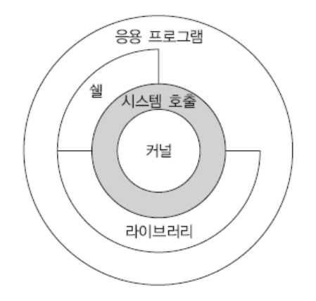
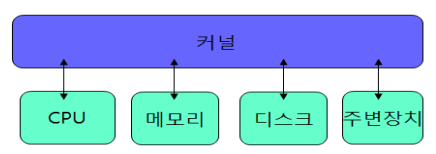
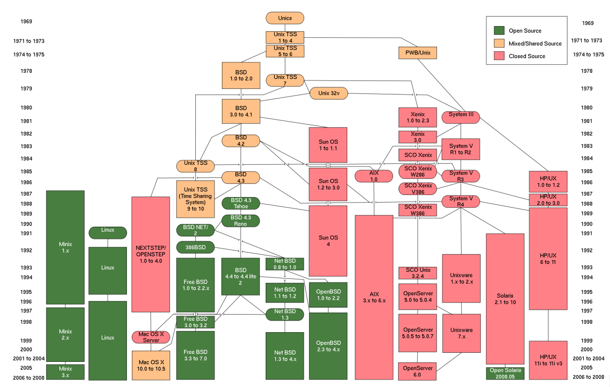

# Unix
- 1970년대 초 AT&T 벨 연구소에서 개발됨
- 이후 지속적으로 발전되어옴
- PC, 스마트폰, 서버 시스템, 슈퍼컴퓨터 등에 사용됨
- 소프트웨어 경쟁력의 핵심이 되고 있음

## Unix/Linux 기반 운영체제들
- Android OS
- iOS
- macOS
- Linux
- BSD Unix
- 시스템 V
- Sun Solaris
- IBM AIX
- HP-UX
- Cray Unicos
- ...

## Unix의 설계 철학
- ### 단순성
	- MIT MULTICS에 반대해, 최소한의 기능만 제공함
	- 자원에 대한 일관된 관점을 제공
- ### 이식성
	- 이시성을 위해 C 언어로 작성됨
	- 다양한 플랫폼에 이식 가능
- ### 개방성
	- 소스 코드 공개 등

## Unix의 특징
- ### 다중 사용자, 다중 프로세스
	- 여러 사용자가 동시에 사용 가능
	- 여러 프로그램이 동시에 실행됨
	- 관리자(Super user)가 있음
- ### 셸 프로그래밍
	- 명령어, 유틸리티 등을 사용해 작성한 프로그램
- ### 훌륭한 네트워킹
	- 유닉스에서 네트워킹이 시작됨
	- ftp, telnet, WWW, X-window 등

## Unix 운영체제 구조

- ### 운영체제(OS)
	- 컴퓨터의 하드웨어 자원을 운영·관리함
	- **프로그램을 실행할 수 있는 환경**을 제공함
- ### 커널(kernel)
	- 운영체제의 핵심
	- **하드웨어 운영 및 관리**
- ### 시스템 호출(system call)
	- 커널이 제공하는 서비스에 대한 **프로그래밍 인터페이스** 역할
- ### 셸(shell)
	- 사용자와 운영체제 사이의 인터페이스
	- 사용자로부터 명령어를 입력 받고 해석 해, 수행해주는 **명령어 해석기**
## 커널

하드웨어를 운영 관리해 프로세스, 파일, 메모리, 통신, 주변장치 등을 관리하는 서비스를 제공함
### 커널의 역할
- 프로세스 관리(Process management)
	- 여러 프로그램들이 실행될 수 있도록, 프로세스들을 CPU 스케줄링 통해 동시에 수행되도록 관리함
- 파일 관리(File management)
	- 저장장치(디스크 등)에 파일 시스템을 구성해 파일을 관리함
- 메모리 관리(Memory management)
	- 메인 메모리가 효율적으로 사용될 수 있도록 관리함
- 통신 관리(Communication management)
	- 네트워크를 통해 정보를 주고받을 수 있도록 관리함
- 주변장치 관리(Device management)
	- 모니터, 키보드, 마우스 등의 장치를 사용할 수 있도록 관리함

## Unix 역사 및 표준
- AT&T 벨 연구소(Bell Lab)에서 개발됨
- 어셈블리어로 개발되고, 이후 C 언어로 다시 작성됨
- 이론적으로 C 컴파일만 있으면 이식 가능
### Unix의 큰 흐름
- #### System V
	- 벨 연구소에서 개발된 버전이 발전된 OS
	- Unix 버전 중 대표적인 최초의 성공 사례
		- 여러 유틸리티 공개로 일반 사용자들에 확산됨
	- 다양한 상업용 버전으로 발전
		- IBM AIX, Sun Solaris, HP UP-UX 등
- #### BSD Unix (Berkeley Standard Distribution)
	- 공개 소스코드를 기반으로 버크리대학교에서 개선한 OS
	- 주요 기능을 개선함
		- 메모리 관리 기능 향상
		- 네트워킹 기능 추가(TCP/IP 네트워킹, 소켓 등)
	- 상업용 운영체제의 기초
		- Sun OS, macOS 등
- #### Linux
	- PC를 위한 효율적인 유닉스 시스템
	- 1991년, Linus B. Torvalds(리누스 토르발스)에 의해 개발됨
	- 소스코드가 공개됨
	- 다양한 플랫폼에 포팅 가능
	- GNU 소프트웨어와 함께 배포됨

---

# Linux
## 리눅스의 장점
- 풍부하고 다양한 하드웨어를 효과적으로 지원함
	- 대부분의 하드웨어를 지원하는 추세
	- PC, 워크스테이션, 서버 등
- 놀라운 성능 및 안정성
	- 저사양 PC에서도 충분히 빠르고 안정적으로 작동
- 인터넷에 맞는 강력한 네트워크 구축
- 다양한 응용 프로그램들이 개발됨
- 무료 배포판
	- RadHat(상업용), Ubuntu, Fedora, CentOS 등

## 리눅스 설치
- 다양한 패포판
	- 커널은 공유하되, 배포판마다 조금씩 다른 데스크톱 환경, 응용 프로그램을 제공함
	- RadHat(상업용), Ubuntu, Debian, CentOS 등
- 데스크톱 환경
	- 사용하는 데스크톱 환경에 따라 사용방법, 응용 프로그램이 상이함
	- GNOME, KDE, Unity

### 리눅스 설치 방법들
- 배포판 설치
- Wubi를 이용한 우분투 설치
- 원격 로그인(telnet, PuTTy 등)

## 시스템 관리자
- ### superuser(슈퍼 유저)
	- 시스템을 관리할 수 있는 사용자
	- `root` 계정을 사용함
- ### 슈퍼 유저 로그인 방법
	- 직접 `root` 계정으로 로그인
	- 다른 계정으로 로그인 후, `su [사용자명]`명령어 사용
## 사용자 계정 관리
- 사용자 추가: `useradd [옵션] 사용자명`
- 사용자 삭제: `userdel 사용자명`
- 패스워드 변경: `passwd 사용자명`
## 그룹 관리
- 그룹 추가: `groupadd [-g gid] 그룹명`
- 그룹 삭제: `groupdel 그룹명`

