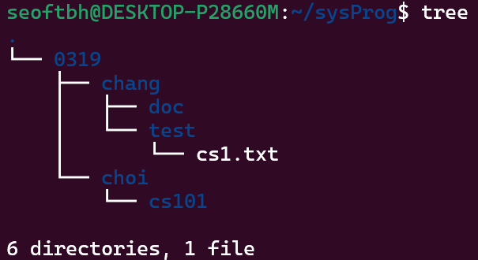
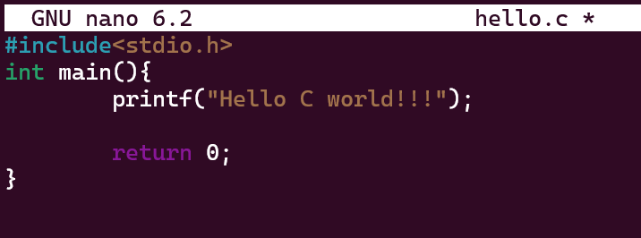
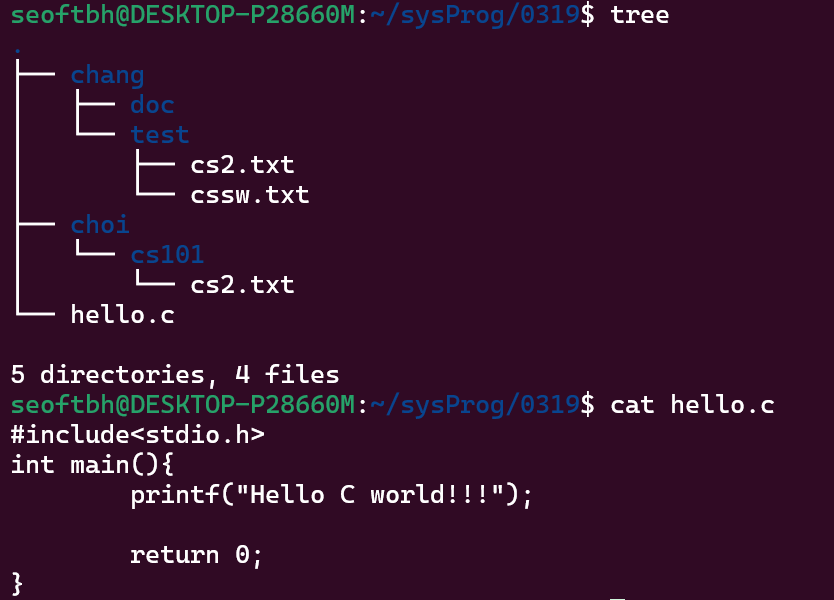
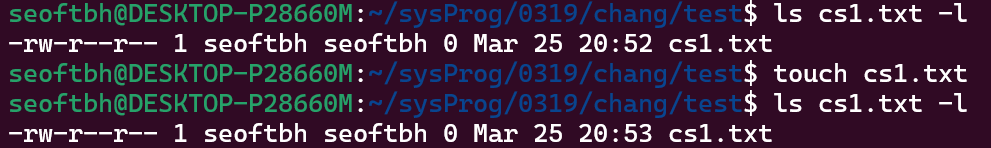
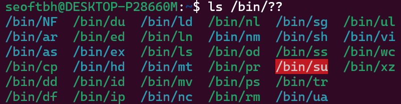
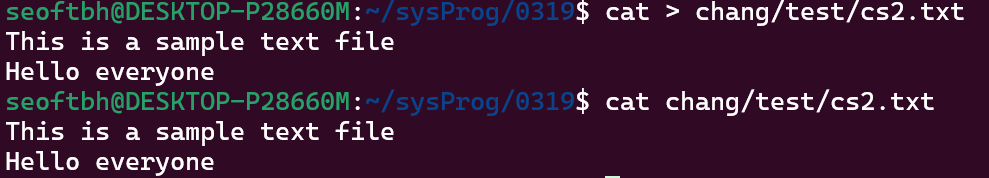
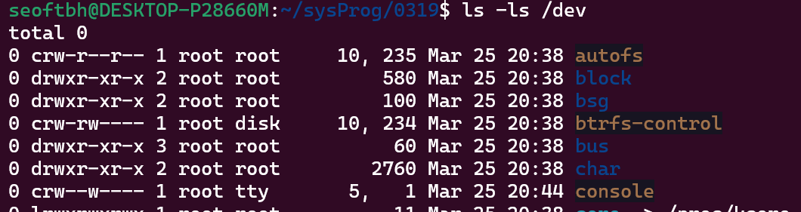
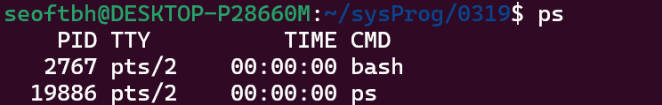

# 리눅스 파일 시스템
### 실습 내용
1) 디렉터리 및 파일 생성하기
	- `mkdir`, `touch`
	- `tree`
	- 
1) 파일명 변경, 파일 복사하기
	- `mv`, `cp`
2) nano 에디터로 파일 작성하기
	- `nano`
	- 
### 실습 결과


---

### 쉘과 커널

### 파일 시스템의 2가지 개념
- 디렉터리 구조
- 실제 디스크 파일의 운영

### 디렉터리와 관련된 기본 명령어들
- `cd`: 
- `rm`
- `mkdir`
- `pwd` 현재 작업중인 디렉터리의 위치를 출력
	- (**p**rint **w**orking **d**irectory)

### 리눅스 파일 시스템의 특징
- 멀티 유저
	- 모든 사용자는 특정한 디렉터리에서 작업합
	- 각 사용자마다 디렉터리를 부여함
		- → 홈 디렉터리
			- `~` (tild)로 표현됨
			- ex) `cd ~` : 홈 디렉터리로 이동
> tild도 상대 경로임 (루트가 아니기 때문)
### 주소를 나타내는 방식 2가지
- 절대 경로
	- **루트**를 기준으로 시작되는 경로
- 상대 경로
	- 현재 디렉터리가 기준이 되는 경로
		- **점**을 이용해 표현함
			- `.` 현재 디렉터리
			- `..` 상위 디렉터리
> 컴퓨터 시스템에서는 이 두가지 정보로 운영함


---
## 실습) 디렉터리 및 파일 생성하기
### `mkdir`
폴더를 생성하는 명령어
- `mkdir 디렉터리_이름`
- ex) `mkdir 0319`
### 파일 만들기
- `touch 파일명.확장자`
- `touch cs1.txt`
### `tree`
디렉터리의 계층 구조를 트리 모양으로 나타내는 명령어
#### 설치 방법
```sh
sudo snap install tree
```
#### 실행 결과

### `touch`
- 파일의 타임 스탬프를 변경하는 명령어
	- 명령어를 실행한 시점으로 업데이트함
	- 파일이 존재하지 않는 경우 빈 파일을 생성함


- `ls cs1.txt -l`
	- `ls`: 디렉터리의 내용물의 목록 출력
		- `-l`: 파일 · 디렉터리에 대한 자세한 정보를 출력하는 옵션
- `touch cs1.txt`
	- `touch`: 파일 스탬프 업데이트
### 와일드 카드
- `*` → all을 의미
- `?` → one을 의미
#### `ls`명령어에서 와일드 카드 사용의 예)
`ls /bin/??`
이름이 두 글자인 파일만 표시된 모습

### `rm`
파일 및 디렉터리를 삭제하는 명령어
#### 옵션
- `-f` (force): 경고 없이 강제로 삭제
	- 디렉터리가 비워져 있지 않으면 경고 메시지가 표시됨
- `-r` (recursive): 하위의 파일 · 디렉터리도 재귀적으로 삭제

#### 사용 예)
`rm -rf chang`
- `chang` 디렉터리의 하위 디렉터리 · 파일까지 삭제됨


### `cat`
- 파일의 내용을 출력하는 명령어
	- 예) `cat cs1. txt`
- 참고) CMD(DOS)에서는 `type`을 이용
	- 예) `type cs1.txt`

#### `cat` 명령어를 이용한 파일 생성 및 내용 작성하기
```
cat > 파일명.확장자
```
- ex) `cat > chang/test/cs2.txt`
- 입력 종료는 <kbd>Ctrl</kbd> + <kbd>D</kbd> (`^D)
	- EOF(End of File)을 의미



### `cp` (copy)
파일을 복사하는 명령어
```
cp 원본파일명 복사본파일명
```
- 예) `cp cs1.txt cs2.txt`
- 대상이 되는 파일이 이미 존재한다면 덮어쓰기됨

## 실습2) 파일명 변경 & 파일 복사
```
0319/chang/test/cs1.txt의 이름을 cssw.txt로 변경하세요
0319/chang/test/cs2.txt 파일을 choi/cs101로 복사하세요.
```

### `mv` (move)
- 파일을 이동시키는 명령어
- 같은 디렉터리를 대상으로 이동하는 경우 rename(이름 변경)으로 작동함
	- 예) `mv cs1.txt cssw.txt`

```
mv chang/test/cs1.txt chang/test/cssw.txt
cp chang/test/cs2.txt choi/cs101
```


> 참고 - 상대 경로를 이용한 다른방법) 
> pwd가 `0319/chang/test`일 때
> `mv ./cs2.txt ../../choi/cs101`
> `mv chang/test/cs1.txt cssw.txt`


### 파일 속성 (file attribute)
`dev`(device)디렉터리에서 다양한 파일 타입들을 볼 수 있음
`-`, `d`, `l`, `p`, `s`, `b`, `c`, 등
```
ls -l /dev
```



### 파일 권한
- 리눅스는 멀티 유저
	- 여러 명이 동시에 사용함
	- 각 사용자는 무조건 특정 그룹에 속해 있음
- 파일에 기본적으로 설정되어 있음
- 사용자, 그룹, others 순서
	- `owner`: 소유자; 파일을 만든 사람
	- `group`: 그룹
	- `other`: 기타; 그룹 외의 사용자들
- 권한의 종류
	- 읽기(`r`)
	- 쓰기(`w`)
	- 실행(`x`)
#### 권한을 표기하는 방식

| 사용 권한 예) | rw- | rw- | r-- |
| -------- | --- | --- | --- |
| 2진수      | 110 | 110 | 100 |
| 8진수      | 6   | 6   | 4   |

#### `chmod` (change mode)
소유자 권한을 수정하는 명령어
예) `chmod 664 cs1.txt`

#### `chgrp` (change group)
그룹을 변경하는 명령어


### 리디렉션
#### 출력 재지정
##### `>`
```
명령어 > 파일
```
ex) `cat > list1.txt`

- standard output 대신 특정파일로 재지정(리디렉션)하는 것
	- 기본 출력은 **화면**(모니터)임
- `^D`(<kbd>Ctrl</kbd> + <kbd>D</kbd>)는 EOF(End of File)을 의미

참고)
- 윈도우에서는 `con`명령어를 사용함
	- 예) `copy con temp.tmp`
- `^Z`(<kbd>Ctrl</kbd> + <kbd>D</kbd>)가 EOF을 의미함

> eof의 값은 -1

##### `>>`
기존 파일 뒤에 append시킴 (덧붙임)

#### 입력 재지정
##### `<`
- 표준 입력 장치인 키보드를 대신해 파일을 입력 받도록 재지정함
```
명령어 < 파일
```

ex) `wc < list1.txt`
- 명령의 입력으로 `list.txt`를 지정
- `list.txt`에 대한 문자 수가 출력됨
- `wc`(word count)

#### 표준 입출력 장치
- 표준 입력장치는 **키보드**
- 표준 출력장치는 **모니터**
- ⇒ 이 두가지를 합쳐 **콘솔**이라고 부름

> 콘솔만 있다면 터미널 구성이 가능함
> 키보드 + 모니터 → 터미널


### `|` (pipeline)
- 파이프라인 기호
- 한 명령어의 출력을 다음 명령어의 입력으로 처리함
```shell
명령어1 | 명령어2
```
- 명령어1이 실행한 결과를 받아서 명령어2가 처리함

예)
```
cat text.txt
123456
234567
abcd
321

cat text.txt | sort
123456
234567
321
abcd
```
명령 실행 후 ASCII 순으로 정렬되었음

### 전면처리와 후면처리
- 전면 처리
	- 끝날 때까지 기다려야함
	- 완료가 되어야만 다음 명령어가 실행 가능함
- 후면처리
	- 쉬는 동안에도 계속 명령을 처리하는 것
	- ⇒ 백그라운드 프로세스
#### `sleep`
- `sleep`명령어는 전면 처리에 해당함
- 예)
	- `sleep 10`: 10초간 휴식
	- `sleep 10 &`: `&`를 붙이면 프롬프트가 나오며 다른명령어도 실행 가능함


### 프로세스
#### 프로세스와 프로그램
- 프로그램은 디스크에 있는 것
- 프로세스는 주기억장치에 있는 것
- 프로세스는 실행중인 프로그램

#### `ps`
실행 중인 프로세스 목록을 보여주는 명령어 (유틸리티)

- 사용자의 명령(명령어)을 처리하기 위해 bash(shell, 셸)가 계속 실행되고 있음

#### `kill`
프로세스 작업 끝내는 명령어 (프로세스 실행 종료)
```
kill 프로세스번호(PID)
```


## 실습 3)
nano 에디터로 `hello.c` 작성
```shell
nano hello.c
```

```c
#include<stdio.h>
int main(){
	printf("Hello C world!!!");
	
	return 0;
}
```
