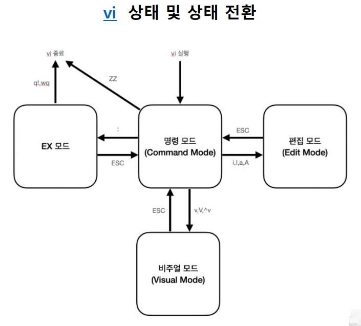
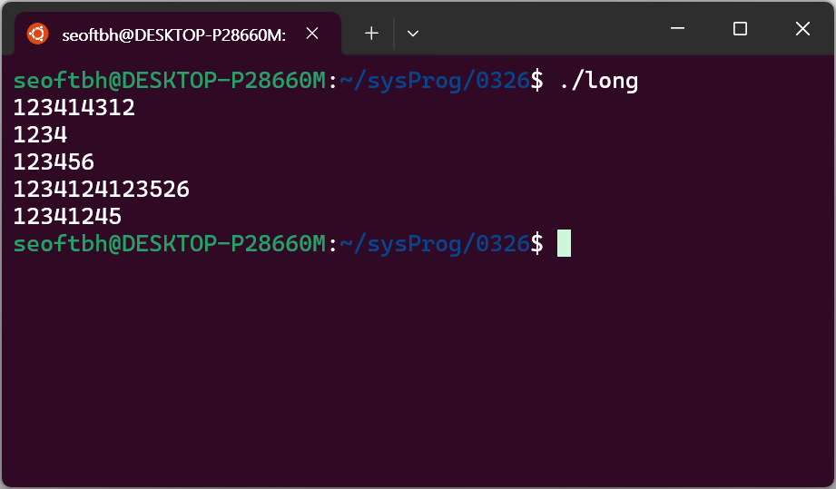

# VI
## VI 명령어


- **명령모드**
	- 편집 모드로 전환
		- `i` 현재 커서 위치
		- `I` 현재 라인 맨 앞
		- `a` 현재 커서 뒤
		- `A` 현재 라인 맨 뒤
	- 커서 이동
		- 문자 단위
			- `h` / `←` 왼쪽
			- `j` / `↓` 아래
			- `k` / `↑` 위
			- `l` / `→` 오른쪽
		- 단어 단위
			- `w` 다음 단어
			- `b` 이전 단어
			- `^` / `0` 현재 라인 맨 앞
			- `$`        현재 라인 맨 뒤
		- 라인 이동
			- `G` 마지막 라인으로
			- `번호G` N번째 라인으로 이동
	- 편집
		- `u` 되돌리기
		- `r` 한 글자 수정
		- 삭제
			- 문자 단위
				- `x` 커서 위치 한 글자
				- `숫자x` 커서 위치 포함 N개 글자
				- `X` 커서 앞 글자
			- 단어 단위
				- `dw` 커서 위치의 단어 삭제
			- 라인 삭제
				- `dd` 현재 라인 삭제
				- `숫자dd` 현재 라인 포함 N줄 삭제
			- `D` 커서 위치부터 라인 끝까지 삭제
	- 복사, 붙여넣기
		- 버퍼에 복사
			- `yy` 현재 라인 복사
			- `숫자yy` 현재 라인 포함 N줄 복사
		- 버퍼의 문자열을 붙여넣기
			- `p` 커서 위치
			- `P` 커서 앞
	- 빈 줄 추가
		- `o` 커서 다음 위치
		- `O` 커서 이전 위치
	- `J` 현재 라인과 다음 라인을 한 라인으로 붙임 (두 줄 합치기)
- **EX 모드** (`:`을 입력 후 아래 명령어를 입력함)
	- 저장 및 종료
		- `w` 변경된 내용 저장
		- `wq` 변경된 내용 저장하고 종료
		- `q!` 변경된 내용 무시하고 종료
		- `q` 종료
	- 문자열 검색
		- `/키워드` 문자열 검색
		- `n` 다음 검색 문자열
		- `N` 이전 검색 문자열
	- 문자열 변경
		- `%s/기존문자열/새로운문자열/ig`
	- 줄 번호
		- `set nu` 표시 
		- `set nonu` 숨기기
- **비주얼 모드**
	- `v` 글자 단위로 선택
	- `V` 라인 단위로 선택
	- `^v` 블록 단위로 선택 (`^`: Ctrl)
	- `y` 선택된 텍스트 버퍼에 복사
	- `d` / `x` 선택된 텍스트 삭제


## 실습 1 - VI로 `long.c` 작성하기
사용자가 입력한 여러 줄의 텍스트 중 가장 긴 줄을 찾아서 출력하는 프로그램

```C
#include <stdio.h>
#define MAXLINE 100 // 상수
void copy(char from[], char to[]); // 함수의 프로토타입
char line[MAXLINE]; // 입력 줄
char longest[MAXLINE]; // 가장 긴 줄
/*입력 줄 가운데 가장 긴 줄 프린트 */
main()
{
	int len;
	int max;
	max = 0;
	while (gets(line) != NULL) {
		len = strlen(line);
		if (len > max) {
			max = len;
			copy(line, longest);
		}
	}
	if (max > 0) // 입력 줄이 있었다면
		printf("%s", longest);
	
	return 0;
}
/* copy: from을 to에 복사; to가 충분히 크다고 가정*/
void copy(char from[], char to[])
{
	int i;
	i = 0;
	while ((to[i] = from[i]) != '\0')
		++i;
}
```




## 컴파일 및 실행하기
### 패키지 업데이트 확인 및 업데이트
```shell
sudo apt-get update
sudo apt-get upgrade
```
### GCC 컴파일러
다양한 프로그래밍 언어를 위한 오픈 소스 컴파일러 모음
(C, C++, Objective-C, Fortran, Ada, Go, D 등)
### 컴파일 하기
`long.c`파일을 컴파일함. 이후 `a.out`이 생성됨
(`a.out`은 이름을 지정하지 않고 컴파일할 때 생성되는 파일의 이름)
```shell
gcc long.c
```
### 실행하기
현재 디렉터리(`.`)에 있는 `a.out`이라는 실행 파일을 실행시키기
```shell
./a.out
```

### 실행 파일의 이름 지정하기
`-o`옵션을 사용함
ex) `hello.c`의 실행 파일을 `hello`로 지정함
```shell
gcc -o hello hello.c
```

## 실습 2 - `long.c`를 모듈화 시키기
`long.c` 파일을 다음 3개의 파일로 모듈화 시킴
- `main.c`
- `copy.c`
- `copy.h`

https://github.com/seoftbh/24-1_SysProg/blob/dea64672668ed644e1b1a18dda3c193d9d54531d/week04/0326/copy.c

https://github.com/seoftbh/24-1_SysProg/blob/dea64672668ed644e1b1a18dda3c193d9d54531d/week04/0326/copy.h#L1-L2

## vimrc
- Vim 편집기의 구성 설정을 담고 있는 파일
- 동작 방식, 플러그인 설정, 키 매핑 등을 사용자가 커스터마이징 가능
- 사용자의 홈 디렉터리에 파일을 위치시킴


---
---


## 동기 & 비동기
- 동기와 비동기의 구분은 대상들의 시간이 맞춰지는지 유무
- **동기**
	- 같이 시작해 같이 끝남
	- 작업 중 끼어들 수 없음
- **비동기**
	- 시작과 끝이 달라도 됨
	- 끼어들어도 됨
## 블로킹 & 논블로킹
- 제어권 반환의 유무
- **블로킹**
	- 다른 작업의 실행이 현재 작업의 실행을 막음
- **논블로킹**
	- 실행해도 제어권이 넘어가지 않고 다시 반환됨

## `grep` 명령어
- (**G**lobal **R**egular **e**xpression **P**rint)
- 파일 내에서 특정 텍스트 패턴이나 문자열을 검색하는 명령어
- 정규 표현식을 사용하여 복잡한 검색 조건을 지정 가능
```shell
grep [옵션] '패턴' 파일명
```


