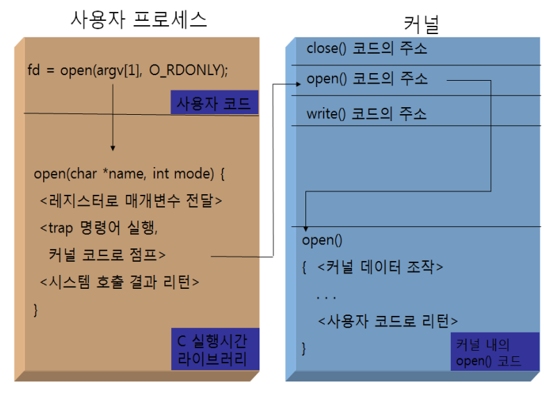

### ToC
- [make 시스템](#make-시스템)
    - [예제1](#예제-1)
    - [예제2](#예제2)
    - [예제3](#예제-3-조건문과-루프)
    - [예제4](#예제-4-makefile-없이-실행하기)
- [컴퓨터 시스템 구조](#컴퓨터-시스템-구조)
- [File](#파일)
    - [실습 - `fopentest.c`](#실습---fopentestc)
---
### C언어 `<...>`와 `"..."`의 차이
- 컴파일러가 헤더 파일을 검색하는 위치의 차이
- 표준 라이브러리 파일들과 사용자 정의 헤더 파일들을 구분하여 관리하는데 사용됨
- **`#include <...>` (부등호)**
	- → 시스템 표준 경로
	- 시스템 또는 컴파일러의 표준 라이브러리 경로에서 헤더 파일을 검색
	- 표준 라이브러리나 외부 라이브러리 헤더 파일을 포함할 때 사용됨
	- ex) `#include <stdio.h>`
- **`#include "..."` (쌍따옴표)**
	- → 소스 파일의 디렉터리
	- 현재 작업 중인 소스 코드 파일과 같은 디렉토리에서 헤더 파일을 검색
	- 찾지 못하면, 시스템의 표준 라이브러리 경로에서 검색을 시도
	- 주로 사용자 정의 헤더 파일을 포함할 때 사용됨
	- ex) `#include "myheader.h"` (사용자가 작성한 헤더 파일)


---
# make 시스템
## Makefile
- 많은 파일을 한 번에 컴파일(빌드) 가능
### 설치
```console
sudo apt-get install gcc make  # make 설치
make -v  # 버전 확인
```

### Makefile의 구조
```
대상: 의존성
	명령
```
- 대상 - 만들어질 파일
- 의존성 - 소스
- 명령

---

### 예제 1)
- `Makefile`
- `main.c`
	- `hello.c`
		- `hello.h`
	- `world.c`
		- `world.h`

https://github.com/seoftbh/24-1_SysProg/blob/1bc0708c90998aac0e871d9e12e0def3adaad71e/week05/0402/make1/hello.h#L4-L6

https://github.com/seoftbh/24-1_SysProg/blob/1bc0708c90998aac0e871d9e12e0def3adaad71e/week05/0402/make1/hello.c#L2-L6

https://github.com/seoftbh/24-1_SysProg/blob/1bc0708c90998aac0e871d9e12e0def3adaad71e/week05/0402/make1/world.h#L4-L6

https://github.com/seoftbh/24-1_SysProg/blob/1bc0708c90998aac0e871d9e12e0def3adaad71e/week05/0402/make1/world.c#L2-L6

https://github.com/seoftbh/24-1_SysProg/blob/1bc0708c90998aac0e871d9e12e0def3adaad71e/week05/0402/make1/main.c#L1-L9

https://github.com/seoftbh/24-1_SysProg/blob/1bc0708c90998aac0e871d9e12e0def3adaad71e/week05/0402/make1/Makefile#L1-L11

> [!warning]
> **인덴트(들여쓰기)에 주의**
>
> `Makefile:2: *** missing separator.  Stop.`
>
> 소스를 가져와 붙여넣기 한 경우 들여쓰기에서 오류발생 함
>
> 공백을 지우고 Tab으로 교체하기

---

### 예제 1-2)
- `make clean` 기능 구현
Makefile
``` title:"Makefile"
CC= gcc
CFLAGS= -g -Wall
OBJS= hello.o world.o main.o
TARGET=app.out

$(TARGET): $(OBJS)
	$(CC) -o $@ $(OBJS)

hello.o: hello.h hello.c
world.o: world.h world.c
main.o: hello.h world.h main.c

clean:
	rm -f *.o
	rm -f $(TARGET)
```

### 실행하기
```bash
make
```


#### `make clean`
- 생성된 모든 실행 파일을 제거함
```bash
make clean
```
---

### 예제2)
- `hello.c`
- `makefile`

https://github.com/seoftbh/24-1_SysProg/blob/1bc0708c90998aac0e871d9e12e0def3adaad71e/week05/0402/make2/hello.c#L3-L6

https://github.com/seoftbh/24-1_SysProg/blob/1bc0708c90998aac0e871d9e12e0def3adaad71e/week05/0402/make2/Makefile#L1-L2


---

### 예제 3) 조건문과 루프
- `hello.c`
- `makefile`

https://github.com/seoftbh/24-1_SysProg/blob/1bc0708c90998aac0e871d9e12e0def3adaad71e/week05/0402/make3/hello.c#L3-L6

https://github.com/seoftbh/24-1_SysProg/blob/1bc0708c90998aac0e871d9e12e0def3adaad71e/week05/0402/make3/makefile#L1-L15


---

### 예제 4) makefile 없이 실행하기
- 내장된 기능을 사용

https://github.com/seoftbh/24-1_SysProg/blob/1bc0708c90998aac0e871d9e12e0def3adaad71e/week05/0402/make4/hello.c#L3-L6

```bash
make hello
```


---
---

## `make` 시스템
- make는 하나의 디렉터리에만 적용됨
	- 하나의 디렉터리에 여러 개의 대규모 파일 관리
- 주로 대규모 프로젝트에서 사용됨
	- 대규모 프로그램의 경우 헤더, 소스 파일, 목적 파일, 실행 파일의
	  모든 관계를 기억하고 체계적으로 관리하는 것이 필요
- 비교
	- make 시스템을 사용하지 않은 경우
		- 하나의 파일만 바뀐 경우 일일이 찾아 컴파일 하는 것은 어려움,
	- make 시스템을 사용한 경우
		- 의존성을 이용해 변경된 파일만 찾아 링크시키고 컴파일됨
### Makefile
- 실행 파일을 만들기 위해 필요한 파일들과 만드는 방법을 기술함
- make 시스템이 파일의 상호 의존 관계를 파악하여 실행 파일을 쉽게 만들 수 있음
- `Makefile` 또는 `makefile` 이름의 파일을 사용
	- `make`가 현제 디렉터리에서 기본적으로 찾는 파일
- `-f` 옵션을 사용해 파일명 사용자 정의 가능
	- `make -f 파일명`
	- 여러 버전의 Makefile 관리에 사용
### Makefile의 구성 형식
>[!warning] 
> **들여쓰기에 유의**
>
> 띄어쓰기 대신 Tab 사용

```
대상리스트: 의존리스트
	명령리스트
```


---
---
# 컴퓨터 시스템 구조
## 유닉스 커널(kernel)
- 하드웨어를 운영 관리함
> 리눅스는 **운영체제**로, 모든 **자원을 관리**함
### 유닉스 커널이 제공하는 서비스
- 파일 관리(File management)
- 프로세스 관리(Process management)
- 메모리 관리(Memory management)
- 통신 관리(Communication management)
- 주변장치 관리(Device management)


## 시스템 호출
- 커널에 서비스를 요청하기 위한 프로그래밍 인터페이스
- 응용 프로그램은 시스템 호출을 통해 커널에 서비스를 요청함
- "커널을 이용하는 방법"
- 미리 정의된 라이브러리를 이용함
	- 대부분 C라이브러리로 만들어져 있음
	- HW를 제어할 수 있는 루틴들이 제공됨


> [!note] 
> 리눅스는 모든 디바이스를 파일로 인식함
>
> 모니터, 키보드, USB 등


> [!note]
> 라이브러리
>시스템 호출을 조금 더 효율적으로 호출시키기 위해 미리 다듬어둔 것

### 시스템 호출 과정


1. 프로세스가 실행 중 `open()`을 만나 인터럽트가 발생함
2. 커널로 이동해 테이블에서 `open()`의 주소를 찾음
3. 해당 주소로 이동해 실제 `open()`코드를 실행 후 리턴됨

> [!note]
> **프로세스**
> : 현재 실행 중인 프로그램

### 시스템 호출 요약

| 주요 자원     | 시스템 호출                                                            |
| --------- | ----------------------------------------------------------------- |
| 파일        | `open()`, `close()`, `read()`, `write()`, `dup()`, `lseek()` 등 \| |
| 프로세스      | `fork()`, `exec()`, `exit()`, `wait()`, `getpid()`, `getppid()` 등 |
| 메모리       | `malloc()`, `calloc()`, `free()` 등                                |
| 시그널       | `signal()`, `alarm()`, `kill()`, `sleep()` 등                      |
| 프로세스 간 통신 | `pipe()`, `socket()` 등                                            |

---

# 파일
## 유닉스에서 파일
- 연속된 바이트의 나열
- 특정한 포맷을 정하지 않음
- 디스크 파일 뿐만 아니라 외부 장치에 대한 인터페이스
	- 키보드도 파일로 인식됨 (바이트의 나열)

## 파일의 사용
- open
	- `open()`: 파일 열기
	- `creat()`: 파일 생성 (쓰기 전용으로 열기)
- use
	- `read()`: 파일 읽기
	- `write()`: 파일 쓰기
- close
	- `close()`: 파일 닫기
### `open()` 파일 열기
```c
#include <sys/types.h> 
#include <sys/stat.h>
#include <fcntl.h>
int open (const char *path, int oflag, [ mode_t mode ]);
# 파일 열기에 성공하면 파일 디스크립터를, 실패하면 -1을 리턴
```
- `open()`의 리턴 타입이 `int` 형
- `path`: 경로
- `oflag`: open flag
- `mode`: 파일의 사용권한 설정
- 리턴 값
	- 파일 열기 성공 시
		- 파일 디스크립터 리턴
			- → 열린 파일을 나타내는 번호
	- 실패 시
		- `-1` 리턴

> `const` → 상수
>
> 헤더파일(`.h`)은 `include` 디렉터리에 있음 (정해진 경로)

> (lib 디렉터리)

> `[ ]`(대괄호)는 생략가능 (optional 을 의미)

> `printf()`의 리턴값도 `int`임
>
> `int printf();`
>
> ex) `"hello"`이면 `5`가 리턴됨

> [!note] 
> **파일 디스크립터**
> - open한 파일들을 구분하기 위해 내부적으로 사용하는 번호
> - 열린 파일을 나타내는 번호
> - 파일을 번호로 구분함 (디바이스도 파일)
> - 디스크립터: '묘사'

---

#### oflag (오픈 플래그)

| flag         | 기능                                                                                                                                 |
| ------------ | ---------------------------------------------------------------------------------------------------------------------------------- |
| `O_RDONLY`   | 읽기 전용으로 열기                                                                                                                         |
| `O_WRONLY`   | 쓰기 전용으로 열기                                                                                                                         |
| `O_RDWR`     | 읽기, 쓰기 모두 가능하게 열기                                                                                                                  |
| `O_APPEND`   | 파일 끝에 데이터 추가                                                                                                                       |
| `O_CREAT`    | 해당 파일이 없는 경우 생성됨 ( ≈ `touch` )<br>(생성 시 파일 접근 모드도 함께 지정해야함 (파일의 권한 설정))                                                            |
| `O_TRUNC`    | 기존 내용을 삭제하고 새로 열기                                                                                                                  |
| `O_EXCL`     | - `O_CREAT`로 파일을 생성하려 할 때 해당 파일이 이미 존재한다면 에러를 반환함<br>- `O_CREAT`와 함께 사용됨<br>- 이미 존재하는 경우 `open` 호출이 실패하도록 강제함                      |
| `O_NONBLOCK` | - 파일이나 다른 리소스를 열 때 논블로킹(non-blocking) 모드로 설정<br>- open 호출이 리소스에 즉시 접근할 수 없는 경우에도 대기하지 않고 바로 반환되도록 함                                |
| `O_SYNC`     | - 디스크에 물리적으로 쓴 후 반환<br>- 파일 쓰기 작업을 동기화(synchronized) 모드로 설정<br> - 쓰기 작업이 완전히 디스크에 기록되고, 모든 메타데이터 업데이트가 완료될 때까지 `write` 호출이 반환되지 않음 |


> [!note]
> **운영체제의 특징**
> - 사용자는 항상 특정한 디렉터리에서 작업함
> 	- pwd명령어
> - 사용자는 항상 특정 그룹에 속해있음
> - 사용자는 항상 특정 디렉터리에서 (명령어를)실행하는데 현재 경로를 생략가능함
> - (현재 작업 중인 디렉터리)

> [!note] 
> **path (환경변수)**
>
> 실행 파일의 경로를 설정하는 것
> - CMD
> 	- `path`
> 	- `;`(세미콜론)으로 구분됨
> - Linux
> 	- `echo $PATH`
> 	- `:`(콜론)으로 구분됨

---

#### 파일 열기의 예
```c
fd = open("account",O_RDONLY);
fd = open(argv[1], O_RDWR); 
fd = open(argv[1], O_RDWR | O_CREAT, 0600);
fd = open("tmpfile", O_WRONLY|O_CREAT|O_TRUNC, 0600);
fd = open("/sys/log", O_WRONLY|O_APPEND|O_CREAT, 0600);
if ((fd = open("tmpfile", O_WRONLY|O_CREAT|O_EXCL, 0666))==-1)
```

`argv[1]`

사용자가 프로그램을 실행할 때 명령줄에서 제공한 첫 번째 인자
열고자 하는 파일의 경로 및 이름

예를 들어, 프로그램 이름이 `myprogram`이고 사용자가 파일 `example.txt`를 열기 위해 터미널에서 `./myprogram example.txt`라고 입력했다면, `argv[1]`은 `"example.txt"`가 됩니다.


`0600` → 파일 권한을 권한을 나타낸 것 (8진수)

---
#### cf) 진수 표기 방법
(based)

| 접두사  | 진수   | 예                |
| ---- | ---- | ---------------- |
| `0`  | 8진수  | `0600` (= 384)   |
| `0x` | 16진수 | `0x600` (= 1536) |
| 없음   | 10진수 | `600` (= 600)    |

https://github.com/seoftbh/24-1_SysProg/blob/1bc0708c90998aac0e871d9e12e0def3adaad71e/week05/0402/test.c#L3-L8

---
#### cf) `return`과 `exit`
C언어의 문법을 지켜서 작성되면
실행 파일이 생성됨

`return`은 자기를 호출한 곳으로 복귀함
- `main()`은 shell(운영체제)가 호출함
	- → 실행이 끝나면 shell로 복귀함
- 호출 주체를 결정하는 것

##### return 예시
`a()`의 실행이 끝나면 `main()`으로 되돌아감
```c
main()
{
	a();
}

a()
{
	return;
}
```


##### exit 예시
`main()`이 아닌 운영체제(shell)로 돌아감
```c
a()
{
	exit;
}
```

---

## 실습 - `fopentest.c`
- `open()`을 이용해 파일을 열고, 파일 열기에 성공한 경우 파일 디스크립트(fd)를 출력하는 프로그램


https://github.com/seoftbh/24-1_SysProg/blob/1bc0708c90998aac0e871d9e12e0def3adaad71e/week05/0402/fopentest.c#L1-L17

`open()`을 사용하기위한 헤더 부분
```
#include <stdio.h>
#include <sys/types.h>
#include <sys/stat.h>
#include <fcntl.h>
```

---

#### cf) 리눅스 man 숫자의 의미
- `3`은 C 라이브러리 `man fopen`
- `2`는 시스템 호출 `man open`
- `1`은 쉘 명령어 `man ls`


---
### `create()` 파일 생성
- path가 나타내는 파일을 생성하고 쓰기 전용으로 엶
- 파일이 이미 존재하는 경우 그 내용을 삭제하고 엶
```c
#include <sys/types.h>
#include <sys/stat.h>
#include <fcntl.h>

int creat (const char *path, mode_t mode);
// 파일 생성에 성공하면 파일 디스크립터를, 실패하면 -1을 리턴
```

### `close()` 파일 닫기
- fd(file description)이 나타내는 파일을 닫음
```c
#include <unistd.h>

int close( int fd );
// fd가 나타내는 파일을 닫음
// 성공하면 0, 실패하면 -1을 리턴

```

### `read()` 데이터 읽기
- fd(file description)이 나타내는 파일에서 nbytes 만큼 읽고, buf(버퍼)에 저장함

```c
#include <unistd.h>

ssize_t read (int fd, void *buf, size_t nbytes);
// 파일 읽기에 성공하면 읽은 바이트 수
// 파일의 끝을 만나면 0
// 실패하면 -1을 리턴

```

- `ssize_t`
	- `size_t` ⇒ `unsigned int`
	- `ssize_t` → 맽 앞의 `s`는 signed를 의미
- `void *`
- `buf`
	- 버퍼

> 버퍼의 데이터 타입은 `char`.
>
> 파일은 바이트들의 나열이기 때문


> [!note] 
> **프로토타입(prototype)**
> : 사용자 정의 함수

---

#### cf) 인터프린터형 언어와 컴파일형 언어
- **인터프린터형 언어**
	- 값을 할당한 순간에 데이터 타입이 결정됨
- **컴파일형 언어**
	- 변수를 만들려면 데이터 타입이 필요함

> C언어에는 `char`, `int`, `long`, `unsigned` 등 10가지가 있음

---
#### 예제 - `fsize.c`
- 파일을 읽고 파일의 사이즈를 출력하는 프로그램
- 파일은 바이트의 연속이므로 리턴 타입으로 `char`가 사용됨
```c title:"fsize.c"
#include <stdio.h>
#include <unistd.h>
#include <fcntl.h>
#define BUFSIZE 512

/* 파일 크기를 계산 한다 */
int main(int argc, char *argv[]) 
{
	char buffer[BUFSIZE];
	int fd;
	ssize_t nread;
	long total = 0;
	if ((fd = open(argv[1], O_RDONLY)) == -1) 
		perror(argv[1]);
	/* 파일의 끝에 도달할 때까지 반복해서 읽으면서 파일 크기 계산 */
	while( (nread = read(fd, buffer, BUFSIZE)) > 0)
		total += nread;
	close(fd);
	printf ("%s 파일 크기 : %ld 바이트 \n", argv[1], total);
	exit(0);
}
```

---

### 파일 디스크립터
- 파일 디스크립터(fd)는 
	- 파이프, FIFO, 소켓, 터미널, 디바이스, 일반 파일 등 
	  종류에 상관없이 모든 열려있는 파일을 참조할 때 사용됨
	- open했다면, 실행 파일을 만들고 실행했다면
	  파일 디스크립터를 사용 가능함
	- 어떤 파일을 실행했을 때 모니터와 키보드도 연결됨
		- 모니터, 키보드도 파일에 해당

`stderr`
- 에러 처리
- 에러 메시지를 처리하는 것
- fd `2`

파일 디스크립터
- fd `0` → 키보드
- fd `1` → 모니터
- fd `2` → 에러 처리 파일

실행되는 파일은 fd `3`에 해당함

그래서 `fopentest.c`의 실행 성공한 fd의 값이 3이된 것

```
./fopentest test.c
```

---


> 비유하면,
> 웹 서버의 세션 아이디 같은 것.
> 사용자를 구분하기 위해 번호를 부여함

- C언어에서 파일을 실행하면 FD 번호가 부여되어 있음
- 0~2는 이미 정해져 있음
- 3번부터 사용할 수 있음
- FD를 이용해 파일 처리함
- file path를 사용하면 길어지므로 숫자로 관리하는 것
- `open()`의 러턴 타입은 `int`. open을 할 때마다 숫자가 증가함

