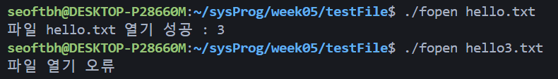
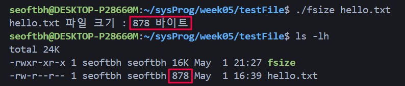
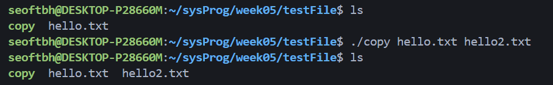
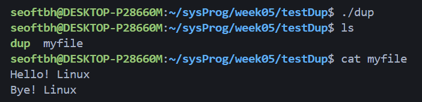

# 파일 열기 `fopen.c`
- 명령 줄 인자로 주어진 파일을 읽기/쓰기 모드(O_RDWR)로 열고, 결과를 출력함
- 파일 열기를 성공한 경우 -> 파일 디스크립터 번호와 함께 성공 메시지를 출력
- 파일 열기에 실패한 경우 ->  오류 메시지를 출력
- 파일 작업을 마친 후에는 파일을 닫고 프로그램을 종료

### 소스코드

### 실행 결과

# 파일 크기 계산 `fsize.c`
- 파일의 내용을 한 번에 버퍼 크기(512바이트)씩 읽으며 전체 바이트 수를 계산함
- 명령줄 인자로 제공된 파일을 읽기 전용 모드(O_RDONLY)로 열고,
- 파일 열기
    - 인자로 받은 파일을 읽기 전용모드로 열기
    - 파일 열기 실패시 오류 메시지 출력
- 파일 읽기
    - 파일의 끝에 도달할 때까지 512바이트씩 읽기를 반복함
    - 각 반복마다 읽은 바이트 수를 `total`에 더함

### 소스코드

### 실행 결과

# 파일 복사 `copy.c`
- 명령줄 인자로 원본 파일과 대상 파일의 이름을 입력하면,
- 원본 파일의 내용을 읽어 대상 파일을 생성함
- 첫 번째 인자로 받은 파일을 읽기 전용으로 열기
    - 실패시 오류 메시지 출력 후 종료
- 두 번째 인자로 받은 파일을 쓰기 전용으로 열기
    - 없다면 생성, 있다면 지우고 열기
    - 파일 접근 권한은 0644(사용자: 읽기/쓰기, 그룹:읽기, 기타: 읽기)

### 소스코드

### 실행 결과

# 파일 디스크립터 복제 `dup.c`
- `creat()` 함수를 사용하여 파일을 생성함
    - 파일 접근 권한: `0600`(사용자: 읽기/쓰기, 그룹: X, 기타: X)
- `dup()` 함수로 파일 디스크립터를 복제한 뒤, 각 디스크립터를 사용하여 파일에 문자열을 기록함

### 소스코드

### 실행 결과

