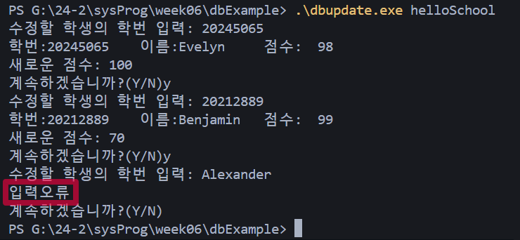

# 파일 위치 포인터 & 레코드
---
## ToC
- [`void *`의 의미](#void-의-의미)
- [파일 위치 포인터](#파일-위치-포인터-file-postion-pointer)
- [레코드 저장](#레코드-저장)
- [레코드 수정](#레코드-수정)
- [핵심 내용 정리](#핵심-내용-정리)
- [과제](#과제)

---
---

## `void *`의 의미
- void 포인터
- 특정한 데이터 유형을 지정하지 않은 포인터
- 다양한 유형의 주소를 저장할 수 잇음
- 다양한 데이터 유형을 다루는 함수나 자료 구조에 활용됨
### `void *`의 특징
#### 유형 무관성
- 어떤 유형의 데이터도 가리킬 수 있음

> 마치 Java의 Object 클래스처럼 
> 모든 데이터 타입을 받을 수 있음
> (어떤 포인터도 가능)

#### 형 변환 필요성
- `void *`로 저장된 주소를 사용하려면 형변환을 해야함
- 명시적으로 `int *`, `char *` 등 다른 유형의 포인터로 형 변환을 해야함

#### 메모리 할당
- 메모리 동적 할당 함수인 `malloc`과 `calloc`은 메모리 공간 할당 후 `void *` 타입으로 반환됨

---
## c언어 자료형의 크기
`char`(1Byte) < `short`(2Byte) < `int`(4Byte) < `long`(4 / 8Byte) < `float`(4Byte) < `double`(8Byte)
- `char`
	- 1Byte
	- 문자 저장(256개의 값 표현 가능)
- `short`
	- 2Byte
	- 작은 정수 저장에 사용
	- 표현 범위: -32768 ~ 32767
- `int`
	- 4Byte
	- 정수 저장
	- 표현 범위: -2,147,483,648 ~ 2,147,483,647
- `long`
	- 32bit 시스템 → 4Byte
	- 64bit 시스템 → 8Byte
	- int 보다 더 큰 정수 값 저장에 사용
- `float`
	- 4Byte
	- 실수 저장
	- 부동 소수점 표현 사용
- `double`
	- 8Byte
	- float 보다 더 정밀한 부동 소수점 저장에 사용

---

## 파일 위치 포인터 (file postion pointer)


- 파일 위치 포인터는 현재 파일 위치(current file position)를 가리킴
	- 파일 내에 읽거나 쓸 위치
- 파일을 오픈하면 제일 처음을 가리킴

### 파일 위치 포인터 이동
#### `lseek()`
- 임의의 위치로 포인터의 위치를 이동시킬 수 있음
- 파일의 내용을 읽고 포인터를 이동시킬 때 사용됨
```c
#include <unistd.h>

off_t lseek (int fd, off_t offset, int whence);
// 포인터를 현재 위치에서 offset만큼 이동시킴
//// 이동에 성공하면 현재 위치를 리턴함
//// 실패하면 -1을 리턴함
```


#### `lseek()` 함수의 프로토타입
```c
off_t lseek(int fd, off_t offset, int whence);
```
- `off_t`
	- 반환값
		- 오류 발생시 `-1` 반환
		- 성공시 파일 오프셋 반환
	- 파일의 크기나 오프셋을 나타내는데 사용되는 데이터 타입
	- `off_t`의 크기는 시스템마다 다를 수 있음
- `fd`
	- 파일 디스크립터
	- 여러 개의 파일을 오픈하기 위해 `fd`가 사용됨
- `offset`
	- 이동하고자 하는 위치의 오프셋 값
	- `whence` 파라미터에 따라 다르게 해석됨
- `whence`
	- `offset`의 기준점을 설정함
	- 파라미터 값
		- `SEEK_SET`: 파일의 시작
		- `SEEK_CUR`: 현재 위치
		- `SEEK_END`: 파일의 끝

---
### 파일 위치 포인터 이동 예제
- 파일 위치 이동
	- `lseek(fd, 0L, SEEK_SET);`: 파일의 처음으로 이동 (rewind)
	- `lseek(fd, 100L, SEEK_SET);`: 파일의 처음에서 100바이트 이동
	- `lseek(fd, 0L, SEEK_END);`:  파일의 끝으로 이동 (append)
- 레코드 단위로 이동
	- `lseek(fd, n * sizeof(record), SEEK_SET);`: n+1번째 레코드 시작위치로 이동
	- `lseek(fd, sizeof(record), SEEK_CUR);`: 다음 레코드 시작 위치로 이동
	- `lseek(fd, -sizeof(record), SEEK_CUR);`: 직전 레코드 시작위치로 이동
- 파일 끝 이후로 이동
	- `lseek(fd, sizeof(record), SEEK_END);`: 파일의 끝에서(파일을 벗어나) 한 레코드 크기만큼 다음 위치로 이동

---

### 데이터의 단위
```
bit < nibble < byte < word < field < recod < table < DB
```
- **Bit**(비트, binary digit)
	- 데이터의 가장 작은 단위
- **Nibble**(니블)
	- = 4bit
	- 컴퓨터에서 10진수를 표현하기 위해서는 4bit 필요
- **Byte**(바이트)
	- = 8bit
	- 2진수 8개로 문자 표현가능
	- (byte = binary term)
- **Word**(워드)
	- 컴퓨터 아키텍쳐에 따라 다름
	- 컴퓨터가 한 번에 처리할 수 있는 데이터의 단위
	- (1word = 64bit)
- **Field**(필드)
	- DB에서 특정 종류의 데이터를 저장하는 구역
	- 데이터의 성격을 규정하는 것
	- (DB의 키에 해당)
		- 레코드를 유일하게 식별할 수 있게 해주는 것
- **Record**(레코드)
	- 필드들의 모음
	- 서로 연관성 있는 필드들의 집합
- **Table**(테이블)
	- 레코드들의 모음
- **Database**(데이터베이스)
	- 하나 이상의 테이블들의 모음

---

### 추상 자료형(Abstract Data Type, ADT)
- 데이터와 그 데이터에 대한 연산들을 함께 묶어놓은 것
- 데이터의 구현 방식에 대해서는 신경 쓰지 않고, 
  데이터 타입이 수행할 수 있는 연산들에 초점을 맞춤
- **C언어에서의 추상 자료형**
	- C언어는 추상 자료형을 직접적으로 지원하지 않음
	- 구조체(struct)를 사용해 구현할 수 있음

---

## 레코드 저장
### 레코드 저장 예제


```c
write(fd, &record1, sizeof(record));
write(fd, &record2, sizeof(record));
lseek(fd, sizeof(record), SEEK_END);
write(fd, &record3, sizeof(record));
```
#### 실행 과정
① record1을 작성함(`write()`), 파일 위치 포인터가 자동으로 이동됨
② record2을 작성함(`write()`), 파일 위치 포인터가 자동으로 이동됨
③ 파일 위치 포인터를 파일의 끝(`SEEK_END`)에서 레코드 크기 만큼 이동시킴(`lseek()`)
② record3을 작성함(`write()`), 파일 위치 포인터가 자동으로 이동됨

#### `write()` 파라미터의 주소 연산자
- `write()`의 두 번째 파라미터는 버퍼의 주소(`void *buf`)를 나타내므로 주소 연산자(`&`)를 이용함

#### `&` 주소 연산자
- 변수의 메모리 주소를 찾는데 사용
- 변수 앞에 사용하면 그 변수의 메모리 주소를 얻을 수 있음

#### `write()` 함수의 프로토타입
```c
ssize_t write (int fd, void *buf, size_t nbytes);
```
- `ssize_t`
	- 반환 값
		- 데이터 전송에 성공한 경우 →  실제로 쓰여진 바이트 수를 반환
		- 오류가 발생한 경우 → `-1` 반환
- `fd`
	- 데이터를 쓸 대상이 되는 파일 디스크립터
- `buf`
	- 쓰기를 수행할 데이터가 저장된 버퍼의 주소
- `count`
	- `buf`에서 `fd`로 전송하고자 하는 데이터의 바이트 수

#### `size_t`와 `ssize_t`
- 주로 메모리, 객체의 크기를 다루는데 사용되는 데이터 타입
##### `size_t`
- 부호 없는 정수 타입(unsigned integer type)
- 시스템에서 객체의 크기를 나타낼 때 사용
- 배열의 크기, 문자열의 길이, 메모리 할당 요청의 크기 등을 나타내는데 사용
- 32bit에서는 4Byte, 64bit 시스템에서는  8Byte로 정의됨
##### `ssize_t`
- 부호 있는 정수 타입(signed integer type)
	- 음수 값 표현도 가능
- 주로 시스템 호출과 같은 함수에서 반환 값을 처리할 때 사용
- `size_t`와 일치하는 범위의 부호 있는 타입

## 레코드 수정
### 레코드 수정 과정


① 파일로부터 해당 레코드를 읽어옴; 파일 위치 포인터는 자동을 이동됨
② 레코드의 내용을 수정함
③ 파일 위치 포인터를 레코드의 시작 위치로 이동시키고, 수정된 레코드를 파일 내에 기록함 (원래의 위치에 기록)


---
---
## 핵심 내용 정리
- **시스템 호출**
	- 커널에 서비스를 요청하기 위한 프로그래밍 인터페이스
	- 응용 프로그램은 시스템 호출을 통해 커널에 서비스를 요청할 수 있음
- **파일 디스크립터**
	- 열린 파일을 나타냄
- **`open()` 시스템 호출**
	- 파일을 열고, 해당 파일 디스크립터를 반환함
- **`read()` 시스템 호출**
	- 지정된 파일에서 원하는 만큼의 데이터를 읽음
- **`write()` 시스템 호출**
	- 지정된 파일에 원하는 만큼의 데이터를 씀
- **파일 위치 포인터**
	- 현재 파일 위치를 가리킴
		- 파일 내에 읽거나 쓸 위치
- **`lseek()`**
	- 지정된 파일의 현재 파일 위치를 원하는 위치로 이동시킴

---
---
# 과제
레코드와 파일 위치 포인터를 이용하는 db 프로그램 실행해보기

- 학생 정보 데이터베이스를 다루는 간단한 시스템
- 학생 정보 생성, 조회, 수정 기능 수행

## 공통 요소
- 터미널을 통해 입력 받음
- `student.h` 헤더 파일에 정의된 `student` 구조체를 사용해 데이터 처리함
- 오류 처리에 `perror()` 및 `exit()` 함수를 사용함
	- 파일 접근 시 필요한 권한 설정 및 오류 확인

## 파일 구성
- `dbcreate.c`
- `dbupdate.c`
- `dbquery.c`
- `student.h`

## 데모에 사용된 입력 예제
```txt
20208613 AlexanderJohnson 75
20212889 BenjaminCharles 99
20229507 CharlotteEmily 73
20231619 DanielRobertson 85
20245065 EvelynThompson 98
20234527 FionaCampbell 78
20247950 GeorgeWilliams 92
20241893 HannahScott 88
20249256 IsaacMitchell 77
20243184 JuliaRoberts 84
```

---
## `student.h`
- 모든 C 파일에서 공통적으로 사용하는 헤더 파일
- 학생 정보를 저장할 `student`**구조체**와 **상수**를 정의
- 레코드의 사이즈는 32Byte
	- `char`(1Byte) * 24(MAX)
	- `int`(4Byte)
	- `int`(4Byte)
	- ⇒ 1 * 24 + 4 + 4 = 32

https://github.com/seoftbh/24-1_SysProg/blob/cd1c439625ac09110f7f3d4745ba3a8cdafa1245/week06/dbExample/student.h#L1-L11

---
## `dbcreate.c`
- 데이터베이스 파일을 생성
- 사용자로부터 학생 정보를 입력받아 파일에 저장
- 파일이 이미 존재하면 에러 메시지를 출력하고 종료
### 작동 구조
- 프로그램은 명령줄 인수로 파일명을 받음
- 파일을 쓰기 모드로 열고, 사용자로부터 학생 정보(학번, 이름, 점수)를 반복적으로 입력받아 파일에 저장
- 각 학생 정보는 학번에 기반하여 파일 내 올바른 위치에 저장됨
	- `lseek()`함수 사용
### 실행 방법
- `./dbcreate filename`형식으로 실행
- 파일명을 인수로 제공해야 함
- 데이터 입력은 터미널을 통해 이루어짐

### 실행 결과


- **입력**받은 학생 정보가 **지정된 파일에 저장**됨
- 저장된 데이터는 순차적이 아닌, **학번에 의해 결정된 위치에 기록**됨
- **이미 존재하는 파일**인 경우 오류를 발생시킴
- 인자가 없이 실행된 경우 **사용법**을 출력함

### 소스 코드

https://github.com/seoftbh/24-1_SysProg/blob/cd1c439625ac09110f7f3d4745ba3a8cdafa1245/week06/dbExample/dbcreate.c#L1-L37

### 주요 라인
```c
    if ((fd = open(argv[1], O_WRONLY|O_CREAT|O_EXCL, 0640)) == -1) {
```
- `O_WRONLY`
	- 파일을 쓰기 전용 모드로 열기
- `O_CREAT`
	- 파일이 존재하지 않으면 새로운 파일 생성
	- 파일이 존재하는 경우, 이 옵션은 무시됨
- `O_EXCL`
	- 파일이 이미 존재하는 경우, `open()`이 실패하도록 만듦
		- 파일 중복 생성 방지
- `0640`
	- 파일의 권한 설정
	- `0640`(base 8) = `110 100 000`(base 2)
		- `110`(6): 사용자 권한 -  읽기 O, 쓰기 O, 실행 X
		- `100` (4): 그룹 사용자 권한 - 읽기 O, 쓰기 X, 실행 X
		- `000` (0): 기타 사용자 권환 - 읽기 X, 쓰기 X, 실행 X

#### `argc`와 `argv`
- `argc`
	- 입력된 인자의 개수
- `argv`
	- 입력된 인자값 배열
	- `argv[0]`은 현재 프로그램의 이름
	- `argv[1]`부터가 실제 입력된 인자 데이터


```c
while (scanf("%d %s %d", &record.id, record.name, &record.score) == 3) {
```
- name은 배열이므로 `&`(주소 연산자)가 생략됨
- `scanf()`는 입력받은 개수를 반환함

```c
lseek(fd, (record.id - START_ID) * sizeof(record), SEEK_SET);
```
- `lseek` 포인터의 위치를 이동시킴
- `#define START_ID 1401001`

```c
write(fd, (char *) &record, sizeof(record));
```
- 레코드의 크기 32byte 만큼 씀(`write()`)

---
## `dbupdate.c`
- 데이터베이스 데이터 업데이트
- 사용자로부터 학번을 입력받아 해당 학생의 정보를 찾아 점수를 수정함
- 파일이 없거나 학번이 존재하지 않을 경우 메시지를 출력하고 계속 진행

### 작동 구조
- 명령줄 인수로 파일명을 받음
- 파일을 읽기/쓰기 모드로 열고, 사용자가 학번을 입력하면 해당 위치로 이동(`lseek` 사용)하여 학생 정보를 읽음
- 사용자로부터 새로운 점수를 입력받아 기존 정보를 업데이트한 후, 파일에 다시 저장함

### 실행 방법
- `./dbupdate filename` 형식으로 실행

### 실행 결과


- 입력한 학번에 대한 학생 정보를 **조회**하고, 점수를 **수정**받음
- **잘못된 입력**을 받은 경우 "입력 오류"를 출력하고 프로그램을 종료 시킴
### 소스 코드
https://github.com/seoftbh/24-1_SysProg/blob/cd1c439625ac09110f7f3d4745ba3a8cdafa1245/week06/dbExample/dbupdate.c#L1-L52

### 주요 라인

```c
    if ((fd = open(argv[1], O_RDWR)) == -1) {
```
- 읽기 및 쓰기 모드로 파일 열기

```c
lseek(fd, (long) (id-START_ID)*sizeof(record), SEEK_SET);
if ((read(fd, (char *) &record, sizeof(record)) > 0) && (record.id != 0)) {
```
- 파일 위치 포인터 이동


---
## `dbquery.c`
- 데이터베이스 검색 및 출력
- 사용자로부터 학번을 입력받아 해당하는 학생의 정보를 파일에서 검색하고 출력
- 파일이 없으면 에러 메시지를 출력하고 종료

### 작동 구조
- 명령줄 인수로 파일명을 받음
- 파일을 읽기 모드로 열고, 사용자가 학번을 입력하면 해당 위치로 이동(`lseek` 사용)하여 학생 정보를 읽고 출력함
### 실행 방법
- `./dbquery filename` 형식으로 실행

### 실행 결과


- 요청된 학번의 **학생 정보를 출력**함
- 학생 정보가 **파일에 존재하지 않을 경우**, "레코드 없음" 메시지를 표시

### 소스 코드
https://github.com/seoftbh/24-1_SysProg/blob/cd1c439625ac09110f7f3d4745ba3a8cdafa1245/week06/dbExample/dbquery.c#L1-L47

### 주요 코드 라인
```c
lseek(fd, (id-START_ID)*sizeof(record), SEEK_SET);
```
- 파일 위치 포인터 이동

---

## 실행 과정
.png)