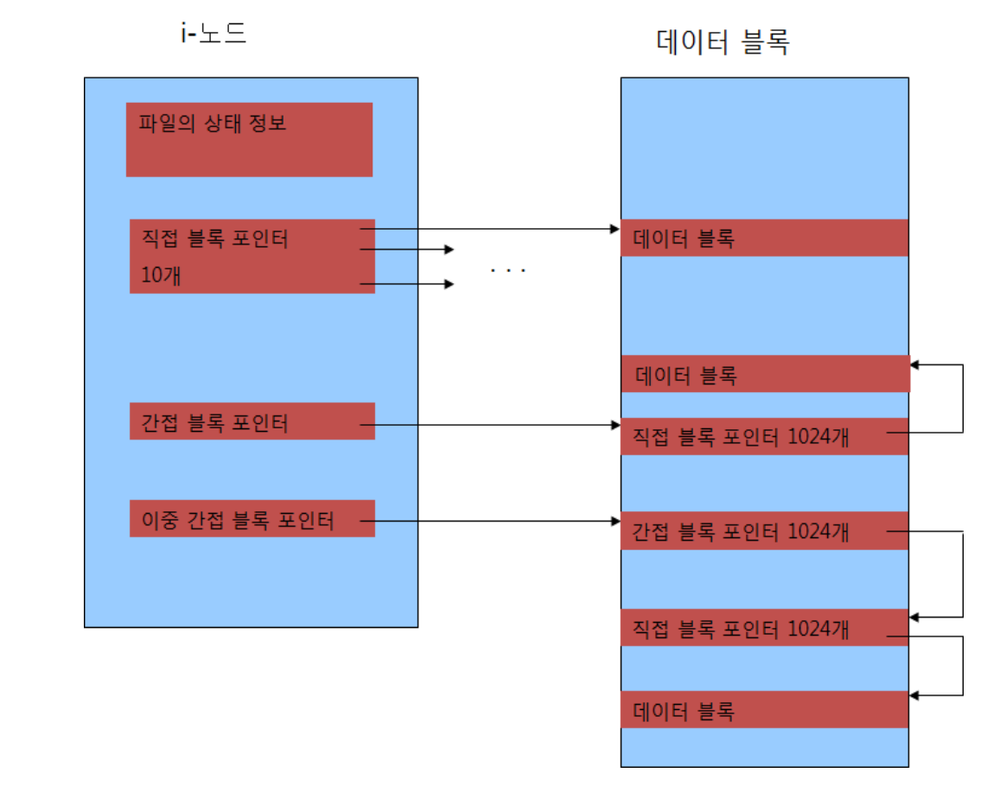
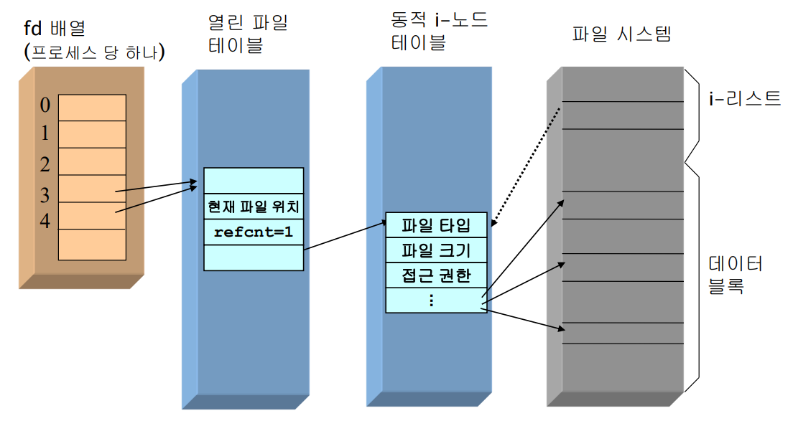

# 파일 시스템
---
## ToC
- [파일 시스템 구조](#파일-시스템-구조)
- [i-노드와 블록 포인터](#i-노드와-블록-포인터)
- [파일 입출력 구현](#파일-입출력-구현)
- [파일 상태](#파일-상태file-status)
- [파일 타입](#파일-타입)
---
## 파일 시스템 구조


### 부트 블록(Boot block)
- 파일 시스템 시작부에 위치함
	- 보통 첫 번째 섹터
- 부트스트랩 코드가 저장되는 블록
	- 부트스트랩 → 디스크의 운영체제가 주기억장치로 올라가는 것

> 부트스트랩 → 장화를 신는 것; 나갈 채비를 하는 것

### 슈퍼 블록(Super block)
- 전체 파일 시스템에 대한 정보를 저장하는 블록
	- 저장되는 정보
		- 총 블록 수
		- 사용 가능한 i-노드 개수
		- 사용 가능한 블록 비트 맵
		- 블록의 크기
		- 사용 중인 블록 수
		- 사용 가능한 블록 수
		- ...

> [!note] 
> **블록 비트 맵**
> 
> 현재 사용중인 블록은 1,
> 사용 가능한 블록은 0으로 표현됨

### i-리스트(i-list)
- 각 파일을 나타내는 모든 i-노드들의 리스트
- 블록 당 40개 정도의 i-노드를 포함

> **i-노드**는 각 파일마다 하나씩 부여됨

> Linux의 `ls`명령어는 i-노드를 이용해 파일 정보를 빠르게 출력함

### 데이터 블록(Data block)
- 파일의 내용(데이터)을 저장하기 위한 블록들

> 실질적인 데이터를 저장함

> [!note] 
> ex) `a.txt`파일
> - 파일에 대한 정보 → **i-노드**에 저장
> 	- 접근 권한 정보(owner, groups, others) 등
> - 실질적인 내용 → **데이터 블록**에 저장

---

### i-Node(i-노드)
- 한 파일은 하나의 i-노드를 가짐
- 파일에 대한 모든 정보를 가지고 있음
	- 파일 타입
		- 일반 파일, 디렉터리, 블록 장치, 문자 장치 등
	- 파일 **크기**
	- 파일이 위치한 장치
	- 사용 권한
	- 파일 **소유자** 및 그룹
	- 접근 및 갱신 시간
	- 데이터 블록에 대한 포인터(주소)
	- ...

> 디스크의 모든 파일은 i-노드를 하나씩 가지고 있음

> 데이터 블록에 대한 포인터는 실질적인 데이터를 보기 위한 용도

---
## i-노드와 블록 포인터


### 블록 포인터
- 파일의 내용을 저장하기 위해 할당된 데이터 블록의 주소
- (데이터 내용이 담겨있는 데이터 블록의 번호를 적어두는 영역)
### 한 i-노드 안의 블록 포인터
- #### 종류
	- **직접 블록 포인터** → 10개
		- 데이터 블록의 주소(번호)를 직접 가지고 있음
	- **간접 블록 포인터** → 1개
		- 한 번 거쳐야 실질적인 주소를 얻을 수 있음
	- **이중 간접 블록 포인터** → 1개
		- (≈ 더블 포인터)

---
## 파일 입출력 구현
### 파일 입출력 구현을 위한 커널 내 자료구조
- 파일 디스크립터 배열(Fd array)
- 열린 파일 테이블(Open File Table)
- 동적 i-노드 테이블(Active i-node table)

> 2차원 배열 형태의 테이블

> [!note] 
> 파일 디스크립터(File Descriptor, FD)
>- 운영 체제가 파일이나 다른 입·출력 자원에 접근하는 방법을 추상화한 것
>- 각 파일 디스크립터는 열린 파일이나 자원을 대표하는 숫자
>- 프로그램이 파일을 열 때, OS는 해당 파일을 대표하는 FD를 할당함

### 파일 디스크립터 배열(Fd Array)
- FD 배열을 프로세스 당 하나씩 가짐
- 열린 파일 테이블의 엔트리를 가리킴
- FD 배열의 인덱스 ⇒ 열린 파일을 나타내는 번호

### 열린 파일 테이블(Open File Table)
- #### 파일 테이블(File Table)
	- 커널 내의 자료구조
	- **열린 모든 파일**의 **목록**
	- #### 파일 테이블 **항목**(File Table Entry)
		- **파일 상태** 플래그
		- **파일의 현재 위치**(current file offset)
		- i-node에 대한 포인터

### 동적 i-노드 테이블(Active i-node Table)
- #### 동적 i-노드 테이블
	- 커널 내의 자료 구조
	- **열린 파일들**의 **i-노드를 저장**하는 테이블
	- #### i-노드
		- 하드 디스크에 저장되어 있는 파일에 대한 자료구조
		- 한 파일은 하나의 i-node를 가짐
			- 한 파일에 대한 정보를 저장함

---

### 파일 열기 구현
`open()` 명령어를 사용하는 동안 구성되는 모양
```c
fd = open("file", O_RDONLY);
```


- FD의 0~2는 예약된 번호
- 각 파일마다 i-노드가 부여됨
- i-노드를 이용해 데이터 블록에 접근함

> [!note] 
> **파일 디스크립터(FD)에서 0~2는 예약된 번호**
> - `0`: 표준 입력
> - `1`: 표준 출력
> - `2`: 표준 에러

> 파일 사용에 필요한 자료 구조
> 
> → 배열 1개와 테이블 2개
> (FD 배열, 열린 파일 테이블, 동적 i-노드 테이블)

---
### 한 파일을 두 번 열기 구현
```c
fd = open("file", O_RDONLY);
fd = open("file", O_RDONLY);
```


- `open()`할 때마다 FD가 부여됨
- 파일은 유니크하므로, i-노드는 하나임

---
### FD 복사
`fd = dup(3)` 또는 `fd = dup2(3,4)`

두 fd가 동일한 열린 파일 테이블의 블록을 가리킴


---
## 파일 상태(file status)
- 파일에 대한 모든 정보
	- (파일의 내용을 제외한 모든 상태 정보)
	- 블록 수
	- 파일 타입
	- 사용 권한
	- 링크 수
	- 파일 소유자의 사용자 ID
	- 그룹 ID
	- 파일 크기
	- 최종 수정 시간
	- ...

### ex) `ls -l hello.c`


> [!note] 
> `ls -l`명령어는 i-node의 정보를 이용해 파일 상태를 표현함

---
### 상태 정보 `stat()`
- 파일 하나당 하나의 i-노드를 가짐
- 그 i-노드 안에는 파일에 대한 모든 상태 정보고 저장되어 있음

```c
#include <sys/types.h>
#include <sys/stat.h>
int stat(const char *filename, struct stat *buf);
int fstat(int fd, struct stat *buf);
int lstat(const char *filename, struct stat *buf);
```
- 파일의 상태 정보를 가져와서 `stat`구조체의 `buf`에 저장함
- 성공하면 `0`, 실패하면 `-1`을 리턴함

> 운영체제에서 `0`은 성공을 의미, 
> 나머지 숫자는 모두 fail을 의미함

### stat 구조체
```c
struct stat {
	mode_t st_mode;  // 파일 타입과 사용 권한
	ino_t st_ino;    // i-노드 번호
	dev_t st_dev;    // 장치 번호
	dev_t st_rdev;   // 특수 파일 장치 번호
	nlink_t st_nlink;// 링크 수
	uid_t st_uid;    // 소유자의 사용자 ID 
	gid_t st_gid;    // 소유자의 그룹 ID 
	off_t st_size;   // 파일 크기
	time_t st_atime; // 최종 접근 시간
	time_t st_mtime; // 최종 수정 시간
	time_t st_ctime; // 최종 상태 변경 시간
	long st_blksize; // 최적 블록 크기
	long st_blocks;  // 파일의 블록 수
};
```
- `_t`가 붙은 자료형들은 `size_t`와 유사한 의미
	- 운영체제(시스템 아키텍처)마다 다르게 작동
	- 일반적인 자료형으로 바뀌게됨

---
## 파일 타입
- **일반 파일**
	- 데이터를 갖고 있는 텍스트 / 이진 파일
- **디렉터리 파일**
	- 파일의 이름들, 파일 정보에 대한 포인터를 포함하는 파일
- **문자 장치 파일**
	- 문자 단위로 데이터를 전송하는 장치를 나타내는 파일
- **블록 장치 파일**
	- 블록 단위로 데이터를 전송하는 장치를 나타내는 파일
- **FIFO 파일**
	- 프로세스 간 통신에 사용되는 파일
	- (이름이 있는 파이프)
- **소켓**
	- 네트워크를 통한 프로세스 간 통신에 사용되는 파일
- **심볼릭 링크**
	- 다른 파일을 가리키는 포인터 역할을 하는 파일

### 파일 타입 검사 함수
파일 타입을 검사하기 위한 매크로 함수
- `S_ISREG()`: 일반 파일
- `S_ISDIR()`: 디렉터리 파일
- `S_ISCHR()`: 문자 장치 파일
- `S_ISBLK()`: 블록 장치 파일
- `S_ISFIFO()`: FIFO 파일
- `S_ISSOCK()`: 소켓
- `S_ISLNK()`: 심볼릭 링크

#### `ftype.c`
https://github.com/seoftbh/24-1_SysProg/blob/5637118763a7923fb4c0ddaa84d44e18c563c72f/week07plus/ftype.c#L1-L35

---
### 파일 사용 권한(File permissions)
- 각 파일에 대한 권한 관리
	- 각 파일마다 사용권한이 있음
- 사용 권한
	- 소유자(owner)
	- 그룹(group)
	- 기타(others)
- 파일에 대한 권한
	- 읽기(`r`, read)
	- 쓰기(`w`, write)
	- 실행(`x`, execute)

#### read 권한으로 파일 열기
- `O_RDONLY`, `O_RDWR`

#### write 권한으로 파일 열기
- `O_WRONLY`, `O_RDWR`, `O_TRUNC`

#### 디렉토리에 액세스하기 위한 권한
- write, execute 권한 → 파일 생성 및 삭제 가능
- 파일 삭제 시에는 read, write 권한 필요 없음

---
### 파일 사용 권한
(file access permission)
- `stat` 구조체의 `st_mode`의 값
- `#include <sys/stat.h>`
- bitwise를 이용함
- 16bit
	- 파일 타입 (4bit)
	- 특수용도 (3bit)
	- 사용권한(소유자, 그룹, 기타 사용자) (9비트)


---
### `chmod()`, `fchmod()`
- 파일 사용 권한(access permission)을 변경함
#### `chmod()`와 `fchmod()`의 프로토타입
```c
#include <sys/stat.h>
#include <sys/types.h>
int chmod(const char *path, mode_t mode);
int fchmod(int fd, mode_t mode);
```
#### 리턴 값
- 성공 → `0`
- 실패 → `-1`
#### `mode`: bitwise OR
- `S_ISUID`, `S_ISGID`
- `S_IRUSR`(user-read), `S_IWUSR`(user-write), `S_IXUSR`(user-execute)
- `S_IRGRP`(group-read), `S_IWGRP`(group-write), `S_IXGRP`(group-execute)
- `S_IROTH`(other-read), `S_IWOTH`(other-write), `S_IXOTH`(other-execute)

### chmod 구현 (`fchmod.c`)
https://github.com/seoftbh/24-1_SysProg/blob/5637118763a7923fb4c0ddaa84d44e18c563c72f/week07plus/fchmod.c#L1-L17

---

### `chown()`
- 파일의 user ID와 group ID를 변경함
- `lchown()`은 심볼릭 링크 자체를 변경함
- super-user만 변환 가능
#### 프로토타입
```c
#include <sys/types.h>
#include <unistd.h>
int chown (const char *path, uid_t owner, gid_t group );
int fchown (int filedes, uid_t owner, gid_t group );
int lchown (const char *path, uid_t owner, gid_t group );
```
#### 리턴
- 성공 → `0`
- 실패 → `-1`

---

### `utime()`
- 파일의 최종 접근 시간, 최정 변경 시간 조정
- (cf. UNIX의 `touch`명령어)
- `times`가 `NULL`인 경우 → 현재 시간으로 설정됨

> `utime()`으로 `touch` 명령어 구현이 가능함
#### 프로토타입
```c
#include <sys/types.h>
#include <utime.h>
int utime (const char *filename, const struct utimbuf *times );
```
#### 리턴
- 성공 → `0`
- 실패 → `-1`

```c
struct utimbuf {
	time_t actime; /* access time */
	time_t modtime; /* modification time */
}
```
- 각 필드는 `1970-1-1 00:00` 부터 현재까지의 경과 시간을 초로 환산한 값

#### `cptime.c`
https://github.com/seoftbh/24-1_SysProg/blob/5637118763a7923fb4c0ddaa84d44e18c563c72f/week07plus/cptime.c#L1-L28
