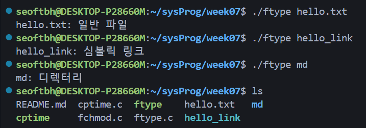
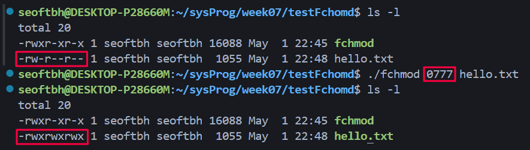
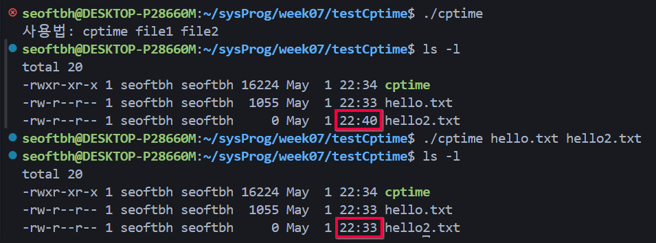

# `ftype.c`
- 파일 타입 검사 함수 구현
<<<<<<< Updated upstream
https://github.com/seoftbh/24-1_SysProg/blob/5637118763a7923fb4c0ddaa84d44e18c563c72f/week07plus/ftype.c#L1-L35

# `fchmod.c`
- chmod(파일 사용 권한) 구현
https://github.com/seoftbh/24-1_SysProg/blob/5637118763a7923fb4c0ddaa84d44e18c563c72f/week07plus/fchmod.c#L1-L17

# `cptime.c`
- `utime()`(타임 스탬프) 구현
https://github.com/seoftbh/24-1_SysProg/blob/5637118763a7923fb4c0ddaa84d44e18c563c72f/week07plus/cptime.c#L1-L28
=======
- 인자로 주어진 파일 또는 디렉터리에 대한 유형을 판단해 출력함
- `lstat()`: 파일, 심볼릭 링크에 대한 정보를 조회하는 시스템콜

### 소스 코드

### 실행 결과

# `fchmod.c`
- 인자로 받은 8진수 형태의 문자열을 정수로 변환 후, 두 번째 인자로 받은 파일에 권한을 적용함
- `chmod()` 특정 파일이나 디렉터리의 접근 권한을 변경하는 시스템 콜
    - (change mode)

### 소스 코드

### 실행 결과

# `cptime.c`
- 첫 번째 파일의 접근 시간과 수정 시간을 두 번째 파일에 복사하는 프로그램
- `utime()`함수를 통해 파일의 접근 및 수정 시간을 수정함

### 소스 코드

### 실행 결과

>>>>>>> Stashed changes
