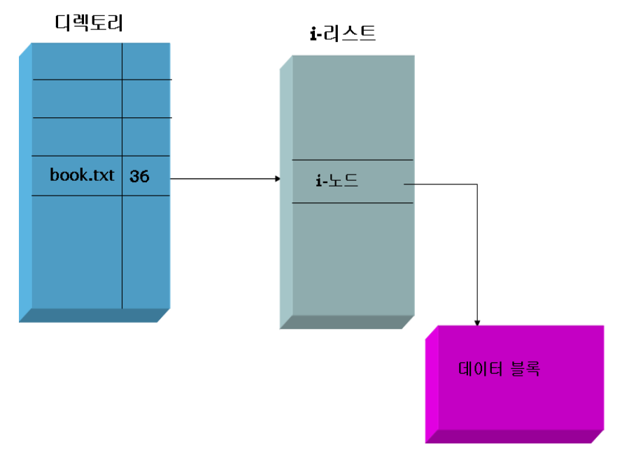
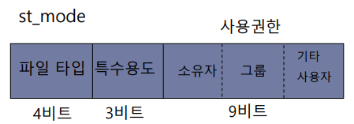
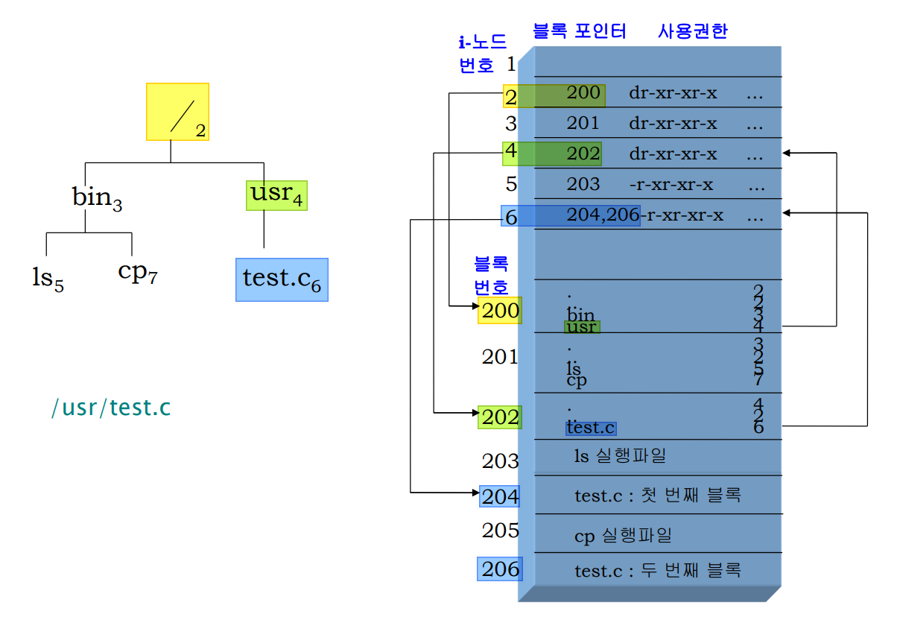
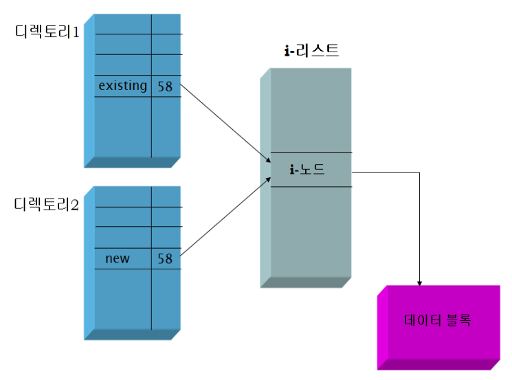

# 파일 시스템 - 디렉터리, 링크
---
## ToC
- [디렉터리](#디렉터리)
    - [디렉터리 엔트리](#디렉터리-엔트리)
    - [디렉터리 리스트](#디렉터리-리스트)
    - [st_mode 필드](#st_mode-필드)
    - [디렉터리 생성](#디렉터리-생성)
    - [디렉터리 삭제](#디렉터리-삭제)
    - [디렉터리 구현](#디렉터리-구현)
- [링크](#링크)
    - [링크 구현](#링크-구현)
    - [링크의 종류](#링크의-종류)
    - [심볼릭 링크](#심볼릭-링크)
- [핵심 정리](#파일-시스템-핵심-개념-정리)

---
# 디렉터리
## 디렉터리 엔트리
- 디렉터리 안에는 디렉터리 엔트리로 저장되어 있음


## 디렉터리 리스트
```c
#include <sys/types.h>
#include <dirent.h>

DIR *opendir (const char *path);
// path 디렉터리를 열고 성공하면 DIR 구조체 포인터를, 실패하면 NULL을 리턴

struct dirent *readdir(DIR *dp);
// 한 번에 디렉터리 엔트리를 하나씩 읽어서 리턴한다. 
```
### `oepndir()`
- 디렉터리 열기 함수
- DIR 포인터를 리턴함
	- 열린 디렉터리를 가리키는 포인터
### `readdir()`
- 디렉터리 읽기 함수

### 예제) `list1.c`

## `st_mode` 필드


### `lstat()`
- 시스템 호출
- 파일 타입과 사용권한 정보는 `st->st_mode` 필드에 함께 저장됨
### `st_mode` 필드 구성
- 파일 타입 (4bit)
- 특수 용도 (3bit)
- 사용 권한 (9bit)
	- owner (3bit)
	- groups (3bit)
	- others (3bit)

### 예제) `list2.c`

---
## 디렉터리 생성
### `mkdir()`
- 시스템 호출
- `path`가 나타내는 새로운 디렉터리를 만듦
- `.`와 `..`파일은 자동으로 생성됨
```c
#include <sys/types.h>
#include <sys/stat.h>
int mkdir (const char *path, mode_t mode ); 
// 새로운 디렉터리 만들기에 성공하면 0, 실패하면 -1을 리턴함
```

## 디렉터리 삭제
### `rmdir()`
- 시스템 호출
- `path`가 나타내는 디렉터리가 비어 있다면 삭제함
```c
#include <unistd.h>
int rmdir (const char *path);
// 디렉터리가 비어 있으면 삭제한다. 성공하면 0, 실패하면 -1을 리턴
```

---
## 디렉터리 구현
- 파일 시스템에서 디렉터리를 위한 구조가 별도로 존재하지 않음
- 디렉터리도 일종의 파일로 구현됨
	- i-노드로 표현됨
- 디렉터리의 내용
	- 디렉터리 엔트리
		- 파일 이름
		- i-노드 번호



---
# 링크
- 기존 파일에 대한 또 다른 이름
```c
#include <unistd.h>
int link(char *existing, char *new);
int unlink(char *path);
```

## 링크 구현
### `link()`
- 시스템 호출
- 기존 파일(`existing`)에 대한 새로운 이름(`new`)으로 링크를 만듦


### 예제) `link.c`

### 예제) `unlink.c`

## 링크의 종류
- ### 하드 링크(hard link)
	- 같은 파일 시스템 안에서만 사용 가능
		- 파일 시스템 안의 i-노드를 가리키기 때문
- ### 심볼릭 링크(symbolic, 소프트 링크, soft link)
	- 실제 파일의 경로명을 저장하고 있는 링크
	- 파일에 대한 간접적인 포인터 역할을 함
	- 다른 파일 시스템에 있는 파일도 링크할 수 있음

## 심볼릭 링크
### 프로토타입
```c
int symlink (const char *actualpath, const char *sympath );
// 심볼릭 링크를 만드는데 성공하면 0, 실패하면 -1을 리턴함
```

```c
#include <unistd.h>

int main(int argc, char *argv[ ])
{
	if (symlink(argv[1], argv[2]) == -1) {
		exit(1);
	}
	exit(0);
}
```

### 심볼릭 링크의 내용
```c
#include <unistd.h>
int readlink (const char *path, char *buf, size_t bufsize);
// path 심볼릭 링크의 실제 내용을 읽어서 buf에 저장함
// 성공하면 buf에 저장한 바이트 수를 반환함
// 실패하면 –1을 반환함
```

### 예제) `rlink.c`


---
# 파일 시스템 핵심 개념 정리
- ### 표준 Unix 파일 시스템의 구성
	- 부트 블록
	- 슈퍼 블록
	- i-리스트
	- 데이터 블록
- ### 파일 입출력 구현하기 위해 커널 내부에 필요한 자료 구조
	- 파일 디스크립터 배열
	- 파일 테이블
	- 동적 i-노드 테이블
	- 등 ...
- ### i-노드
	- 파일 마다 하나의 i-노드를 가짐
	- 내부에는 파일에 대한 모든 상태 정보가 저장되어 있음
- ### 디렉터리
	- 일련의 디렉터리 엔트리들을 포함함
	- #### 각 엔트리의 구성
		- 파일 이름
		- i-노드 번호
- ### 링크
	- 기존 파일에 대한 또 다른 이름
	- #### 종류
		- 하드 링크
		- 심볼릭 링크 (소프트 링크)
