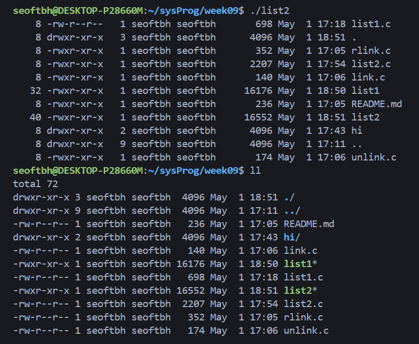

# 디렉터리 내의 파일 리스트 이름 출력 `list1.c`
- `ls` 명령어 구현
- 시스템 콜
    - `opendir()`: 디렉터리를 열고 디렉터리 스트림을 생성 후 `DIR*` 타입의 포인터를 반환함
    - `readdir()`: 디렉터리 스트림에서 다음 파일 엔트리를 읽어 파일의 정보를 담고 있는 `struct dirent` 포인터를 반환함
    - `closedir()`: 디렉터리 스트림 닫기
- C 표준 라이브러리 함수
    - `printf()`: 형식화된 추력
    - `perror()`: 스템 에러 메시지를 해석하여 표준 에러 스트림에 출력
    - `exit()`: 프로그램 종료 및 운영체제에 종료 상태 반환

### 소스 코드
https://github.com/seoftbh/24-1_SysProg/blob/576f7bb2535f9b10320fb23ce589195a22d5e451/week09plus/list1.c#L1-L37

### 실행 결과

# 디렉터리 내의 파일 리스트 이름과 상태 정보들 출력 `list2.c`
- `ls -al` 명령어 구현
- 프로그램 구성
    - main() 메인 프로그램
    - printStat() 파일 상태 정보 프린트
    - type() 파일 타입 리턴
    - perm() 파일 사용권한 리턴
- 시스템 콜: `opendir()`, `readdir()`, `lstat()`, `closedir()`
- C 표준 라이브러리 함수: `printf()`, `sprintf()`, `perror()`, `putchar()`, `exit()`
- `getpwuid()`: 사용자 ID로부터 사용자의 정보를 담고 있는 struct passwd를 반환하는 함수
- `getgrgid()`: 그룹 ID로부터 그룹의 정보를 담고 있는 struct group를 반환하는 함수
- `ctime()`: 시간을 나타내는 time_t 값을 사람이 읽을 수 있는 문자열로 변환함

### 소스 코드
https://github.com/seoftbh/24-1_SysProg/blob/576f7bb2535f9b10320fb23ce589195a22d5e451/week09plus/list2.c#L1-L93

### 실행 결과

# 링크 구현 `link.c`, `unlink.c`
- 시스템 콜 `link()`를 사용해 첫 번째 인자로 주어진 파일의 이름을 두 번째 인자로 주어진 이름으로 하드 링크를 생성함
- `int link(char *existing, char *new)`
- `int unlink(char *path);`

### 소스 코드
https://github.com/seoftbh/24-1_SysProg/blob/576f7bb2535f9b10320fb23ce589195a22d5e451/week09plus/link.c#L1-L11

https://github.com/seoftbh/24-1_SysProg/blob/576f7bb2535f9b10320fb23ce589195a22d5e451/week09plus/unlink.c#L1-L13

### 실행 결과

# 심볼릭 링크 내용 출력 `rlink.c`
- 인자로 주어진 심볼릭 링크가 가리키는 대상을 출력함
- 시스템콜 `readlink()`
    - 심볼릭 링크의 타겟 경로를 읽어서 버퍼에 저장함
    - `argv[1]`에서 링크 경로를 받아와 읽고 버퍼에 저장함
    - 읽은 바이트 수를 반환하고, 에러 발생 시 `-1`을 반환함
- 시스템 콜 `write()`
    - `buffer`에 저장된 데이터를 표준 출력에 쓰고, 쓴 바이트 수만큼 출력함

### 소스 코드
https://github.com/seoftbh/24-1_SysProg/blob/8cf6f77b45091dda4f53d8b345f5c0a0b3a1f1d3/week09plus/rlink.c#L1-L18

### 실행 결과

