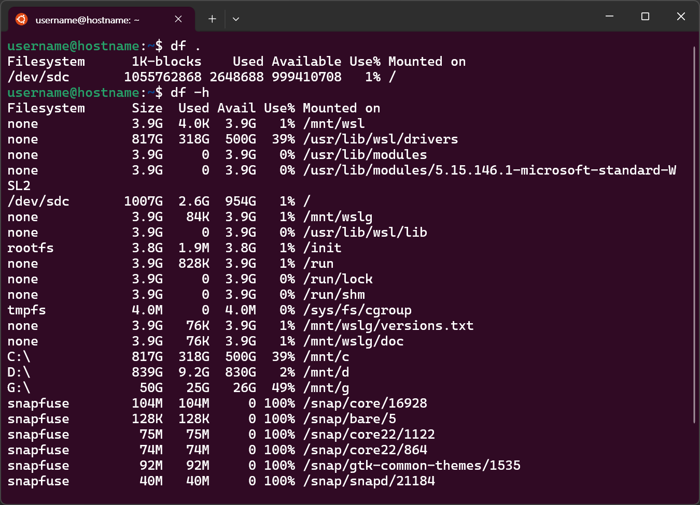
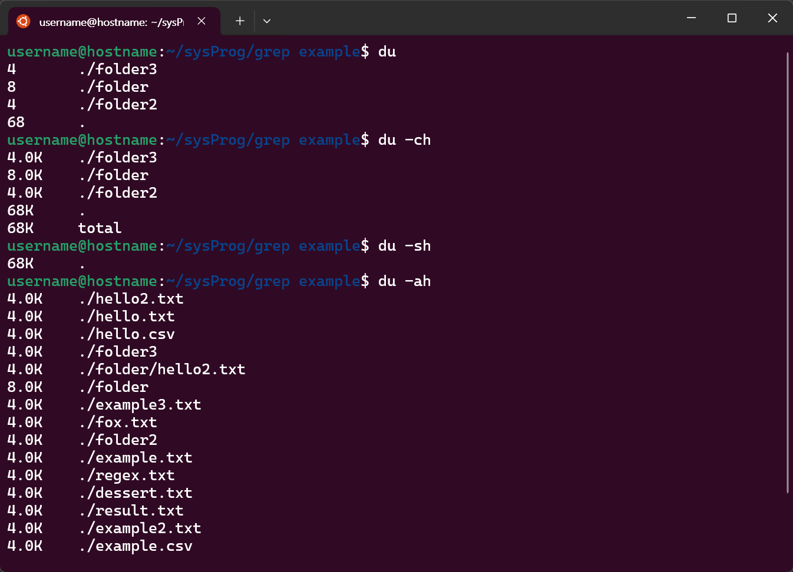
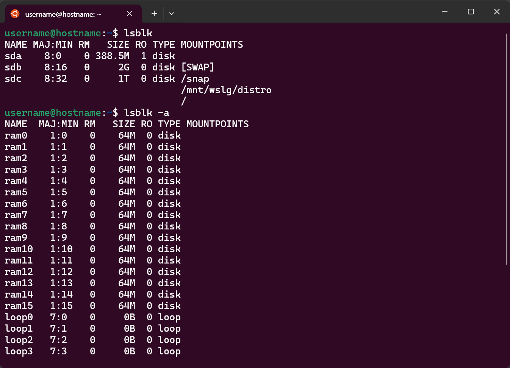
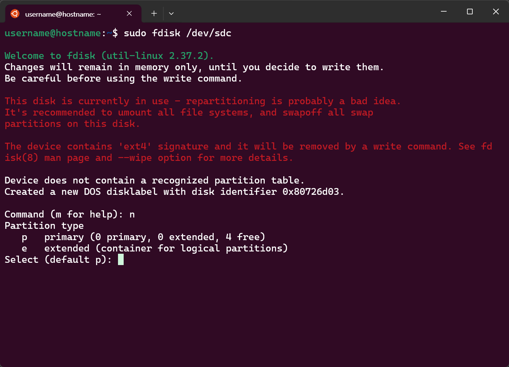
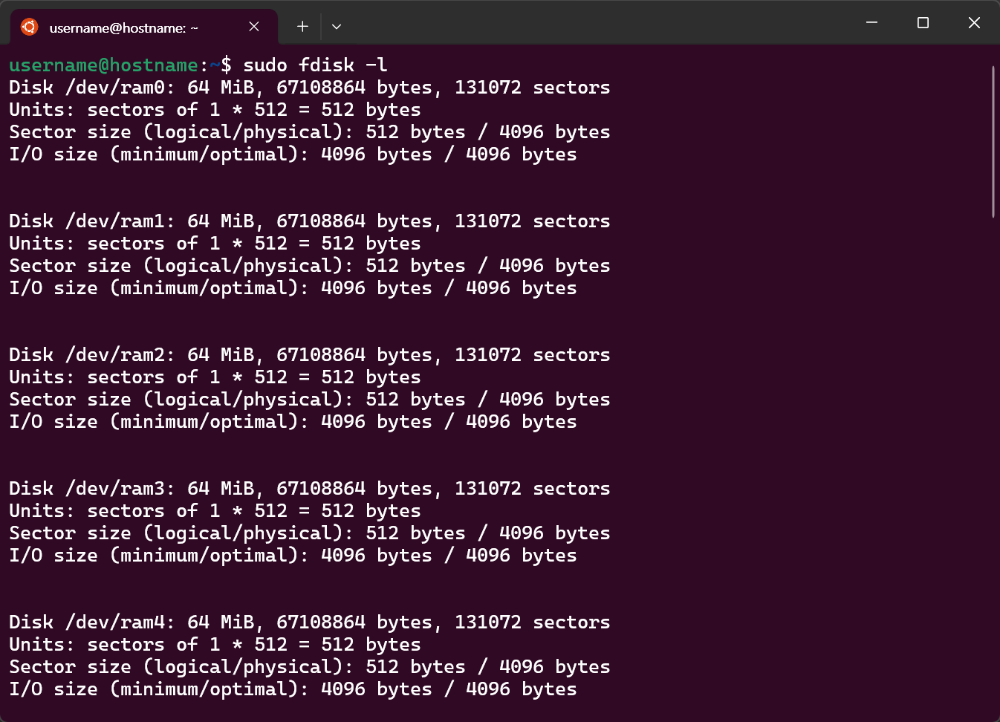
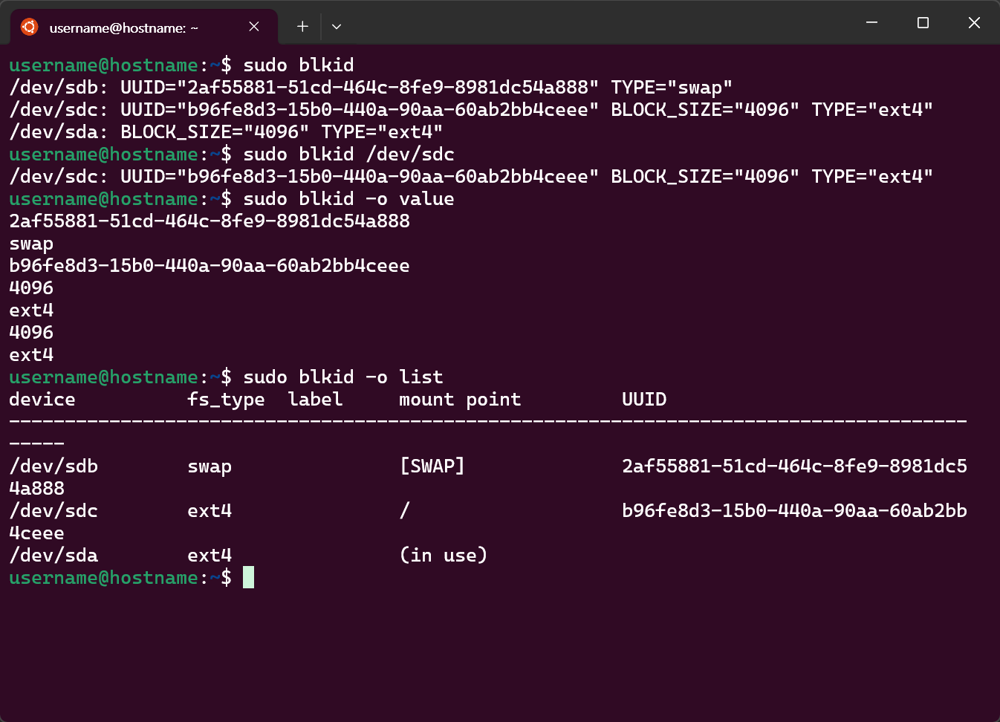
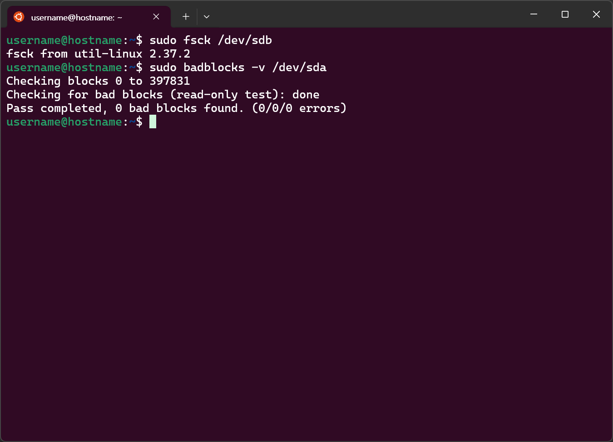

# Linux File system, Disk management
---
## ToC
- [EXT4, XFS, ZFS, NTFS 파일 시스템](#ext4-xfs-zfs-ntfs-파일-시스템)
    - [EXT4](#ext4)
    - [XFS](#xfs)
    - [ZFS](#zfs)
    - [NTFS](#ntfs)
- [df, du, lsblk, fdisk, blkid, mount](#df-du-lsblk-fdisk-blkid-mount)
    - [df](#df-disk-free)
    - [du](#du-disk-usage)
    - [lsblk](#lsblk-list-block-devices)
    - [fdisk](#fdisk)
    - [blkid](#blkid-block-id)
    - [mount](#mount)
- [fsck, badblocks](#fsck-badblocks)
    - [bad block](#bad-block)
    - [fsck](#fsck)
    - [badblocks](#badblocks)

---
# EXT4, XFS, ZFS, NTFS 파일 시스템
## EXT4
- EXT(EXTended file system)
- 우분투, 데비안 등의 리눅스 배포판의 기본 저널링 파일 시스템으로 사용됨

### 특징 및 기능
- #### 대용량 파일 시스템
	- EXT4는 1EB(exabyte)의 파일 시스템을 지원함
	- 서브 디렉터리에 대한 제한도 거의 무한대로 확장
- #### 익스텐드(Extent)
	- 대용량 파일의 메타데이터를 줄이고 성능을 향상시키기 위한 기법
	- 익스텐트 트리를 사용, 대용량의 파일을 효율적으로 나타냄
- #### 파일 시스템 저널에 대한 체크섬 검사
	- 작업 중의 시스템 오류가 발생해도 일관성 유지
	- 체크섬 기능 구현으로 올바른 변경 사항만 파일 시스템에 적용되도록 보장
- #### 사전할당(Pre-allocation)
	- 파일 생성 시 미리 일정 개수의 블록을 보장하는 기법
- #### 지연할당(Delayed-allocation)
	- free block count만 갱신하고 실제 블록 할당은 뒤로 미루는 방식
	- 성능 향상 및, fragmentation 개선됨

## XFS
- 확장성 높은, 단일 호스트 64bit 저널링 파일 시스템
- extents 기반
	- 대용량 파일 시스템 지원
- 빠른 복구를 위한 메타데이터 저널링 지원
- 마운트된 상태로 조각 모음 및 확장 가능
- b-tree 구조 사용
	- 우수한 I/O 확장성 제공
	- 모든 사용자 데이터 및 메타 데이터 인덱스
### 특징
- #### 저널링
- #### 익스텐트 기반 할당
	- 메타데이터로 소비되는 공간, 조각화를 최소화
	- 대용량 파일의 성능 향상
	- 지연 할당, 사전 할당 지원
- #### 트랜잭션
	- 데이터 읽기/쓰기 트랜잭션으로 인한 성능 저하 최소화
- #### 높은 확장성
	- 완전한 64bit 파일 시스템
	- 대용량 파일도 안정적으로 관리
## ZFS
- 안정성, 성능, 데이터 보호 기능 강화된 파일 스토리지를 목적으로 개발
- 파일 시스템과 볼륨 매니저를 함께 제공
- 물리적 스토리지, 볼륨 구조 뿐만 아니라, 저장된 파일에 대한 정보도 가짐
### 특징
- #### 스토리지 풀(Storage Pool)
	- 볼륨 확장 / 디스크 추가 시 스토리지 풀에 결합
		- 결합 직후 용량이 반영됨
	- 실제 사용한 공간 만큼만 차지함
		- → 효율적으로 디스크 사용 가능
- #### COW 트랜잭션
	- 기록 시 복사(Copy-On-Write)
	- 스토리지에서 데이터를 관리하기 위해 사용되는 모델
	- 이전 데이터는 쓰기작업 완료 후 유지됨, 데이터를 절대 겹쳐 쓰지 않음
- #### 체크섬

## NTFS
- New Technology File System
- Windows 운영체제의 기본으로 탑재되는 파일시스템
### 특징
- #### 안정성 강화 기능
	- 저널링
	- VSC(Volume shadow copy)
		- 파일 및 폴더의 백업본 유지
		- 저널링 기능과 함께 안전한 복구 지원
- #### 보호 기능
	- EFS(Encrypting File System)
		- 인증받지 않은 사용자, 프로그램으로부터 사용자의 데이터를 암호하해 보호하는 기능
		- 암호화된 파일/폴더를 이동해도 암호화는 유지됨
	- 파일 압축(File Compression)
		- 공간 절약 기능
		- 압축으로 인한 파일 접근 성능 저하될 수 있음
	- (Windows에서, (특정 파일의) 속성 > 고급 특성 > 압축 또는 암호화 특성)
- #### 타 파일 시스템과의 호환성을 위한 기능
	- 유니코드 지원
		- 다국어 지원
		- 파일, 폴더, 볼륨 등의 이름 지정 시 사용됨
	- ADS(Alternate Data Streams)
		- macOS에서 사용하는 파일 시스템과 호환성을 위한 ADS 영역
		- 파일 요약 정보 저장, 영역 실별자로 사용됨

### 이동 저장 장치 (USB)의 파일 시스템
- #### FAT32
	- 윈도우 포맷 기준 최대 32GB 지원
	- 파일 당 최대 4GB
	- 구조가 간단, 읽기·쓰기 속도가 빠름
	- 호환성·안정성 높음
- #### NTFS
	- 드라이브 최대 256TB 지원
	- 파일 최댇 크기 16TB
	- 보안 및 복구 기능 강화
	- 호환성 낮음
		- 사실상 윈도우 전용
- #### exFAT
	- 최대 드라이브 크기, 파일 크기 512TB
	- 호환성 높음
	- 안정성은 낮음

## 주요 용어
### 파일 시스템
- 장치에 데이터를 저장할 때 데이터의 위치나 파일명, 형식 등을 결정하는 방법
- 운영체제가 파일을 시스템의 디스크 상에 구성하는 방식
### 저널링(journaling)
- 데이터베이스에서 일관성 체크를 위해 사용되는 방법
- 파일 시스템의 장애를 방지하기 위해 저널(기록, 데이터의 변경 이력)을 남겨두는 기능
	- 데이터의 복구, 백업 등에 이용됨

## 파일 시스템 확인하기
### `findmnt`
- Linux 파일 시스템에서 마운트 정보를 확인하는 데 사용되는 도구
- 전체 파일 시스템의 상세한 정보를 한 눈에 파악 가능
	- 디스크 관리, 문제 해결에 용이
- 특정 디렉터리, 파일에 대한 디스크 사용량은 확인 불가


---
---
# df, du, lsblk, fdisk, blkid, mount
- Linux 시스템에서 파일 시스템과 디스크 관리에 사용되는 명령어들
	- 디스크 공간 모니터링, 파티션 관리 등

## `df` (disk free)
- 시스템에 마운트된 모든 파일 시스템의 **디스크 여유 공간** 표시
- 파일 시스템, 전체 크기, 사용 중인 공간, 여유 공간, 사용률, 마운트 위치
- ### 옵션
	- `-h` (human readable): 사람이 읽기 쉬운 형식으로 출력 (ex: MB, GB)
	- `-T` (type): 파일 시스템 유형을 함께 표시
	- `-i`: inode 정보를 표시
		- (파일 시스템의 메타데이터를 저장)


---
## `du` (disk usage)
- 특정 디렉터리의 **디스크 사용량** 표시
	- 하위 디렉터리, 파일도 포함
- ### 옵션
	- `-s` (summarize): 지정된 디렉터리의 총 사용량만 표시
		- 하위 디렉터리 표시 생략
	- `-h` (human readable): 사람이 읽기 쉬운 형식으로 출력 (ex: MB, GB)
	- `-a` (all): 파일과 디렉터리 모두 표시
	- `-c` (total): 합계 산출


---
## `lsblk` (list block devices)
- 시스템에 연결된 모든 **블록 장치**의 **정보**를 목록으로 표시
	- 마운트 되지 않은 블록 장치 포함
- ### 옵션
	- `-f` 파일 시스템 유형과 마운트 포인트 정보를 포함하여 출력
	- `-m`: 권한, 소유자, 그룹 정보를 포함해서 출력
	- `-o`: 출력될 정보를 선택 해 컬럼을 지정
		- ex) `lsblk -o NAME,SIZE,FSTYPE,UUID,MOUNTPOINT`
- ### 출력 내용
	- `NAME`: 디바이스 이름
	- `MAJ:MIN`: 메이저, 마이너 번호
	- `RM`: 제거 가능한 미디어 유무 (Removable media)
		- `0`: 제거 불가능
	- `SIZE`: 디바이스의 총 크기 (M: Mega, G: Giga, T: Tera)
	- `RO`: 읽기 전용(Read Only) 표시
		- `1`: 읽기 전용
	- `TYPE`: 디바이스 유형
	- `MOUNTPOINTS`: 마운트 포인트


---
## `fdisk`
- **파티션 관리** 도구
	- 파티션 생성, 수정, 삭제
		- 
	- 디스크 및 파티션 목록 보기
		- - Command: `n` 파티션 나누기
		- Command: `m`: help 
		- 
- ### 옵션
	- `-l`: 디스크에 대한 파티션 테이블 출력 (파티션 구성 확인)
	- `-u`: 파티션의 시작과 끝을 섹터 단위로 표시
	- `m`: 사용 가능한 모든 옵션 보기

---
## `blkid` (block id)
- 블록 장치의 UUID, 파일 시스템 유형 정보들을 출력
- ### 옵션
	- `-o value`: 지정된 키에 대한 값만 출력 (ex: `LABEL`, `UUID`)
	- `-s TAG`: 특정 태그에 해당하는 정보만 출력 (ex: `UUID`, `TYPE`)
- ### 사용 예
	-  커널이 인식한 모든 블록 디바이스의 정보 출력
		- `blkid` (옵션 생략)
		- ( = `blkid -o full` (모든 태그 출력) )
	- 특정 블록 디바이스의 정보만 출력 `blkid 디바이스명`
		- ex) `blkid /dev/sdc`
	- `-o`: 출력 포맷 지정
		- ex) `blkid -o LABEL`
	- 모든 block의 마운트 여부, UUID, LABEL 정보를 표로 출력
		- `blkid -o list`
	- 

---
## `mount`
- 파일 시스템을 디렉터리에 연결
- (마운트: 저장 장치나 파일 시스템을 사용자가 접근할 수 있는 시스템의 디렉터리 구조에 통합하는 과정)
- ### 옵션
	- `-t type`: 마운트할 **파일 시스템의 유형**을 지정 (ex: `-t ext4`)
		- `iso9660`: CD-ROM, DVD 에 사용하는 ISO 유형
		- `vfat`, `ext4`, `ntfs`, ...
	- `-o options`: **마운트 옵션**을 지정
		- `ro`(read only), `rw`(read & write), ...
	- `-a`: `/etc/fstab`에 기술된 모든 파일 시스템을 마운트
- ### 사용 예제
	- `{bash} sudo mount -o remount,ro /dev/sda1`
		- `/dev/sda1`을 읽기 전용으로 재마운트
	- `{bash} sudo mount -t ext4 /dev/xvda2 /`
		- `ext4` 파일 시스템으로 포맷된 `/dev/xvd2` 파티션을 `/`에 마운트
	- `{bash} sudo mount -t iso9660 -o ro Win11_23H2_x64.iso /mnt/iso`
- ### 참고) unmount
	- `unmount 장치명`, `unmount 디렉터리명`


---
---
# fsck, badblocks

## bad block
- 데이터를 읽어올 수 없는 디스크 저장 장치의 블록
- (= bad sector)
### bad block 발생 원인
- Soft
	- 논리적인 요인으로 인한 문제
		- 정전, 비트 오류, 펌웨어 등의 문제
- Hard
	- 물리적인 요인으로 인한 문제
		- 저장 장치에 물리적인 문제
			- 충격, 먼지 침투 등

## fsck
- file system check
- Linux 파일 시스템에서 파일을 체크하고 수리하는 명령어
- cf) MS-DOS, Windows에서는 `chkdsk`, `sfc`, `scandisk`

```bash
fsck [옵션] [파일시스템]
```

### 옵션
- `-A`: `/etc/fstab` 파일에 표시된 모든 파일시스템을 한 번씩 모두 점검
- `-R`: `-A` 옵션과 함께 사용 시, 루트 파일시스템을 제외하고 점검
- `-T`: 버전정보 출력 끄기
- `-V`: 자세히 출력하기
- `-N`: 실행하기 전, 작업 수행여부를 확인함
- `-f`: 강제로 검사
- `-b 슈퍼블록`: 지정한 백업 슈퍼블록 사용
- `-y`: 모든 질문에 yes로 대답
- `-a`: 문제 발생시 자동 복구

## badblocks
- Linux 파일 시스템에서 하드디스크나 기타 저장 장치의 배드 블록(bad block)을 검사하는 명령어

```bash
badblocks [-b 블록크기] [-o 출력파일] [-v] [-w]
```

### 옵션
- `-b 블록크기`: 블록크기를 바이트 수로 나타냄
- `-o 파일명`: 지정한 파일에 배드 블록의 리스트를 기록함
- `-v`: 자세한 출력 모드
- `-e 최대블록개수`: 점검을 멈출 최대 블록 개수를 지정함
	- `0`으로 설정한 경우 → 지정된 범위에서 멈춤
- `-p num passes`: 지정된 숫자만큼 디스크 스캔을 반복함
- `-w`: 읽기/쓰기 모드에서 배드블록을 검사함
	- `-n`옵션과 함께 사용할 수 없음
- `-n`: 비파괴 읽기/쓰기 모드
	- `-w`옵션과 함께 사용할 수 없음
- `-s`: 검사 진행 과정을 표시


> 두 검사 모두 배드 블록이 검출되지 않음

---

