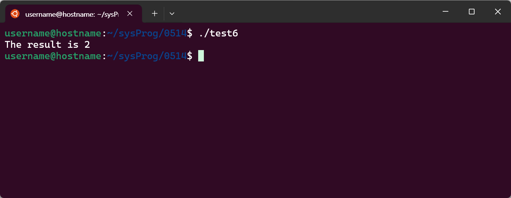
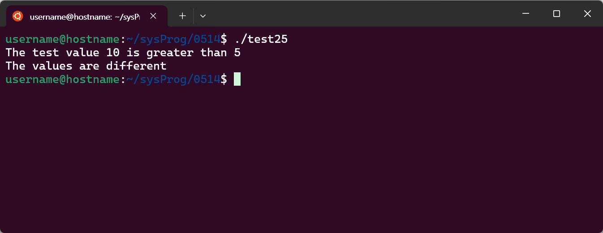

# Shell Scripting
---
## ToC
- [셸 스크립팅](#셸-스크립팅)
    - [스크립트 파일 생성 및 실행 방법](#스크립트-파일-생성-및-실행-방법)
    - [스크립트 파일 생성 및 실행 자동화](#스크립트-파일-생성-및-실행-자동화)
    - [참고) Windows에서 배치 파일 생성 및 실행](#참고-windows에서-배치-파일bat-생성-및-실행)
- 예제
    - [test0](#test0---인자값-전달하기)
    - [test1](#test1---메시지-표시하기)
    - [test2](#test2---환경-변수)
    - [test3](#test3---사용자-변수)
    - [test4](#test4---변수-할당)
    - [test5](#test5---백틱)
    - [test6](#test6---expr)
    - [test7](#test7----operation-)
    - [test8](#test8---bash-셸-수학-연산자는-정수-연산만-지원)
    - [test13](#test13---종료-명령-매개변수)
    - [test14](#test14---종료-명령-매개변수에-변수-사용)
    - [test14b](#test14b---종료-명령-매개변수-주의-사항)
    - [test21](#test21---if-then-문-사용하기)
    - [test22](#test22---if-문이-실행되지-않는-예)
    - [test23](#test23----if-then-사용-예제)
    - [test24](#test24---if-then-else-문)
    - [test25](#test25---숫자-비교-조건식)
    - [test27](#test27---문자열-비교-)
    - [test28](#test28---문자열-비교-)

---
## 세미콜론을 이용해 명령어를 연속으로 처리하기

```bash
date; who
```
- `date` 실행 후 `who`가 실행됨
	- `date`: 현재 시스템의 날짜와 시간이 기본 형식으로 출력
	- **`;`** (세미콜론)이 두 명령어를 순차적으로 실행되도록 함
	- `who`: 현재 시스템에 로그인한 모든 사용자의 정보를 출력


## 셸 스크립팅

### `#!/bin/bash` (Shebang)
- 유닉스 계열 운영 체제에서 스크립트 파일의 첫 번째 줄에 사용하는 특별한 형태의 주석
- 스크립트를 실행할 때 사용할 인터프리터(해석기)를 지정하는 역할
- `/bin/bash`(절대 경로)에 위치한 `bash` 인터프린터를 사용해 스크립트를 실행함

### 스크립트 파일 생성 및 실행 방법
#### Vim을 이용한 파일 생성 및 저장
- ① 파일 생성
	- `vi test1`
- ② 작성
	1. <kbd>i</kbd> 키를 눌러 입력 모드 진입
	2. 내용 작성
- ③ 저장 및 종료
	1. 입력 모드에서 <kbd>Esc</kbd>키를 눌러 명령 모드 실행
	2. 저장 및 종료하기
		- `:wq!`(저장 및 종료) 콜론 명령어 실행
		- 또는 <kbd>Shift</kbd> + <kbd>ZZ</kbd>
#### 실행 권한 부여
```bash
chmod +x test1
```
#### 스크립트 실행
```bash
./test1
```

## 스크립트 파일 생성 및 실행 자동화

- 스크립트를 생성하고, 실행 권한을 부여한 후, 해당 스크립트를 실행하는 일련의 단계를 자동화함
```bash title:"run"
vi $1
chmod +x $1
./$1
```

- ① `vi $i`
	- 스크립트를 실행할 때 사용자가 입력한 첫 번재 인자를 이용해 vi 편집기로 파일을 생성함
	- 사용자가 실행된 Vim 에디터에서 스크립트 코드를 작성 하고, 저장 및 종료함
- ② `chmod +x $1`
	- 생성한 파일에 실행 권한을 부여함
- ③ `./$1`
	- 생성된 파일을 실행함

#### 실행
ex) `test5` 스크립트를 생성 및 실행하기
```bash
./run test5
```


## 참고) Windows에서 배치 파일(.bat) 생성 및 실행
### 파일 생성
```cmd
copy con a.bat
dir
dir /w
^Z
```
- `copy con a.bat`
	- `copy con`: 파일 생성 및 내용을 입력받아 저장
	- `a.bat` 파일을 생성하며, 사용자의 입력이 기록됨
- `dir`: 현재 디렉터리의 파일, 디렉터리 목록을 자세히 표시
- `dir /w`: 현재 디렉터리의 파일, 디렉터리 목록을 넓은 형식으로 표시
	- 파일 이름만 나열 & 한 줄에 여러 파일이름이 표시됨
- `^Z`: 파일 입력을 종료 및 저장
	- <kbd>Ctrl</kbd> + <kbd>Z</kbd> 키를 누름
### 실행
```cmd
a
```
이 배치 파일을 실행하면, 현재 디렉터리의 파일 목록을 두 번, 각각 자세히와 넓은 형식으로 출력됨

---
---
## 예제

### `test0` - 인자값 전달하기

- 현재 스크립트의 이름과 첫 번째, 두 번째, 세 번째 인자가 출력되는 스크립트
#### 코드
```bash title:"test0"
echo $0 $1 $2 $3
```
- `$0`: 현재 실행 중인 스크립트의 이름
- `$1`, `$2`, ... : 스크립트에 전달된 첫 번째 인자, 두 번째 인자, ...

#### 실행
```
./test0 arg1 arg2 arg3
```
- 스크립트가 실행될 때 전달된 인자들이이 터미널에 출력됨


---
> Linux Command Line and Shell Scripting Bible, 2nd Edition.pdf
> Part 2 - Chapter 10 (220p)

---
### `test1` - 메시지 표시하기
> 220p

```bash title:"test1"
#!/bin/bash
# This script displays the date and who's logged on
echo The time and date are:
date
echo "Let's see who's logged into the system:"
who
```


- `echo`에서는 따옴표를 이용해 문자열을 구별함
	- 문자열 내에 `'`(따옴표)를 사용하려면 `"`(큰따옴표)안에 넣어야 함
	- 반대로, `"`(큰 따옴표)를 사용하려면 `'`(작은 따옴표)로 감싸야 함


### `test2` - 환경 변수
> 225p

```bash title:"test2"
#!/bin/bash
# display user information from the system.
echo "User info for userid: $USER"
echo UID: $UID
echo HOME: $HOME

```


- `$USER`: 사용자 ID
- `$UID`: UID
- `$HOME`: 환경 변수

### `test3` - 사용자 변수
> 226p

```bash title:"test3"
#!/bin/bash
# testing variables
days=10
guest="Katie"
echo "$guest checked in $days days ago"
days=5
guest="Jessica"
echo "$guest checked in $days days ago"
```


- 셸 스크립트는 변수 값에 사용되는 데이터 유형을 자동으로 결정함
- 스크립트 내에서 정의된 변수는 실행되는 동안 유지되다가 실행이 끝나면 삭제됨
- `$`(달러 기호)를 사용해 참조함

### `test4` - 변수 할당
> 226p

- 변수 값을 참조할 때는 달러 기호를 사용함
- 변수에 값을 할당하기 위해 변수를 참조할 때는 달러 기호를 사용하지 않음
```bash title:"test4"
#!/bin/bash
# assigning a variable value to another variable
value1=10
value2=$value1
echo The resulting value is $value2
```


- `$`기호를 사용한 경우 (`value2=$value1` )
	- → 실행 결과: `The resulting value is 10`
- `$`기호가 누락된 경우 (`value2=value1`)
	- → 실행 결과: `The resulting value is value1`
		- `value1`이 변수로 참조되지 않고 문자열로 사용됨

### `test5` - 백틱
> 227p

- 백틱을 사용해 셸 명령의 출력을 변수에 할당하기
```bash title:"test5"
#!/bin/bash
# using the backtick character
testing=`date`
echo "The date and time are: " $testing
```


### `test6` - expr
> 234p

- `expr`: 셸에서 수학 방정식을 처리하는 데 제공되는 명령
- 백틱 문자를 사용하여 출력을 추출해 변수에 할당함
```bash title:"test6"
#!/bin/bash
# An example of using the expr command
var1=10
var2=20
var3=`expr $var2 / $var1`
echo The result is $var3
```


> [!note]
> 대부분의 expr 명령 연산자는 셸에서 별표와 같은 다른 의미를 가지므로, 스크립트나 명령줄에서 사용할 때 문제가 발생함
> (`*`를 와일드 카드로 해석함)
> `expr 5 * 2` → 실행 결과: `expr: syntax error`
> 
> ---
> 이스케이프 문자(백슬래시)를 사용해 해결함
> `expr 5 \* 2` → 실행 결과: `10`

### `test7` - `$[ operation ]`
> 234p

- bash 셸에서는 수학 방정식을 달러 기호 및 대괄호(`$[ 연산 ]`)로 묶어 수행하는 방법도 제공됨

```bash title:"test7"
var1=100
var2=50
var3=45
var4=$[$var1 * ($var2 - $var3)]
echo The final result is $var4
```


### `test8` - bash 셸 수학 연산자는 정수 연산만 지원
> 235p

- bash 셸 스크립트에서 수학을 수행하는 데에는 한 가지 큰 제한이 따름
	- → bash 셸 수학 연산자는 정수 연산만 지원함
	- 해결 방법 → 내장된 bash 계산기인 `bc`를 이용해야 함
```bash title:"test8"
#!/bin/bash
var1=100
var2=45
var3=$[$var1 / $var2]
echo The final result is $var3
```


### `test13` - 종료 명령 매개변수
> 239p

- 셸 스크립트는 기본적으로 마지막 명령의 종료 상태와 함께 종료됨
- 아래 코드처럼 종료 상태를 지정할 수 있음
	- 스크립트 종료 시 임의의 종료 상태 코드를 반환할 수 있음

```bash title:"test13"
#!/bin/bash
# testing the exit status
var1=10
var2=30
var3=$[ $var1 + var2 ]
echo The answer is $var3
exit 5
```


### `test14` - 종료 명령 매개변수에 변수 사용
> 240p

- 종료 명령 매개변수에 변수를 사용하기
```bash title:"test14"
#!/bin/bash
# testing the exit status
var1=10
var2=30
var3=$[ $var1 + var2 ]
exit $var3

```


### `test14b` - 종료 명령 매개변수 주의 사항
- 종료 상태 코드는 최대 255까지만 가능
```bash title:"test14b"
#!/bin/bash
# testing the exit status
var1=10
var2=30
var3=$[ $var1 * var2 ]
echo The value is $var3
exit $var3
```


- 종료 상태 코드는 0에서 255 범위로 축소됨
	- 셸은 모듈로 산술을 사용하여 이를 수행함
	- 출력 결과로는 지정된 숫자의 나머지를 256으로 나눈 값
- ex) `300`
	- 300의 나머지인 44(모듈로 연산)가 종료 상태 코드로 반환됨

---
> Chapter 11 (242p)

---
### `test21` - if-then 문 사용하기
> 242p
#### bast 셸의 if-then 문 형식
```sh
if command
then
	commands
fi
```
#### bash 셸의 if문 특징
- 프로그래밍 언어에서의 if 문
	- if 문 뒤에 오는 객체의 참 또는 거짓 값으로 평가되는 수식임
- bash 셸의 if 문
	- if 문에 정의된 명령을 실행함
	- 명령의 종료 상태가 `0`인 경우
		- (`0`: 명령이 성공적으로 완료됨)
		- → `then` 섹션 아래에 나열된 명령이 실행됨
	- 명령의 종료 상태가 다른 값인 경우
		- then 명령은 실행되지 않고, bash 셸은 다음 명령으로 이동

```bash title:"test21"
#!/bin/bash
# testing the if statement
if date
then
echo "it worked"
fi
```


### `test22` - if 문이 실행되지 않는 예
> 243p

- 아래 예제 코드에서, if 문에 작동되지 않는 명령어를 사용함
	- `0`이 아닌 종료 상태를 생성함
	- `then` 섹션의 코드를 건너뜀

```bash title:"test22"
#!/bin/bash
# testing a bad command
if asdfg
then
    echo "it did not work"
fi
echo "we are outside of the if statement"
$
$ ./test2
./test2: line 3: asdfg: command not found
we are outside of the if statement
```


### `test23`  - if-then 사용 예제
> 243p

- `grep $testuser /etc/passwd`
	- `grep` 명령어로 `/etc/passwd` 파일을 검색
	- 특정 사용자 아이디(예제: `rich`)가 현재 시스템에서 사용 중인지 확인함
- 실행 결과
	- 사용자가 존재하는 경우
		- `then` 절을 실행함
		- 사용자의 HOME 디렉터리에 있는 bash 파일들을 나열함
	- 존재하지 않는 경우
		- `then` 절을 실행하지 않음
		- 아무것도 출력되지 않음

```bash title:"test23"
#!/bin/bash
# testing multiple commands in the then section
testuser=rich
if grep $testuser /etc/passwd
then
	echo The bash files for user $testuser are:
	ls -a /home/$testuser/.b*
fi
```


### `test24` - if-then-else 문
> 244p

- if 문 줄의 명령이 종료 상태 코드를 `0`이 아닌 것을 반환하면 `else` 섹션의 명령이 실행됨

```bash title:"test24"
#!/bin/bash
# testing the else section
testuser=badtest
if grep $testuser /etc/passwd
then
	echo The files for user $testuser are:
	ls -a /home/$testuser/.b*
else
	echo "The user name $testuser does not exist on this system"
fi
```


### `test25` - 숫자 비교 조건식
> 246p

- `$val1 -gt 5`: 변수 val1의 값이 5보다 큰가
- `$val1 -eq $val2`: 변수 val1의 값이 변수 val2의 값과 같은가

```bash title:"test25"
#!/bin/bash
# using numeric test comparisons
val1=10
val2=11

if [ $val1 -gt 5 ]
then
	echo "The test value $val1 is greater than 5"
fi
if [ $val1 -eq $val2 ]
then
	echo "The values are equal"
else
	echo "The values are different"
fi
```


### `test27` - 문자열 비교 (`=`)
> 248p

- 사용자의 이름이 문자열(예제: `rich`)과 같다면 then 절의 메시지를 출력함
```bash title:"test27"
#!/bin/bash
# testing string equality
testuser=rich

if [ $USER = $testuser ]
then
	echo "Welcome $testuser"
fi

```


### `test28` - 문자열 비교 (`!=`)
- 두 문자열이 같지 않음을 비교
- 실행 결과
	- 같지 않은 경우 → then 절의 명령이 실행됨
	- 같은 경우 → else 절의 명령이 실행됨
```bash title:"test28"
#!/bin/bash
# testing string equality
testuser=baduser
if [ $USER != $testuser ]
then
	echo "This is not $testuser"
else
	echo "Welcome $testuser"
fi
```

