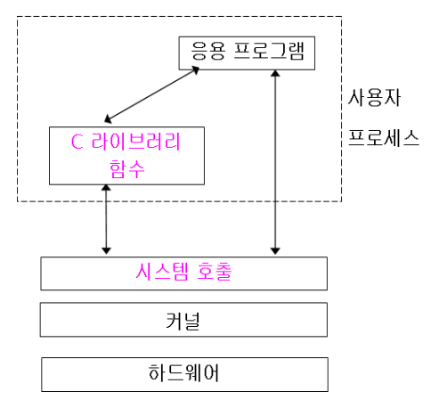
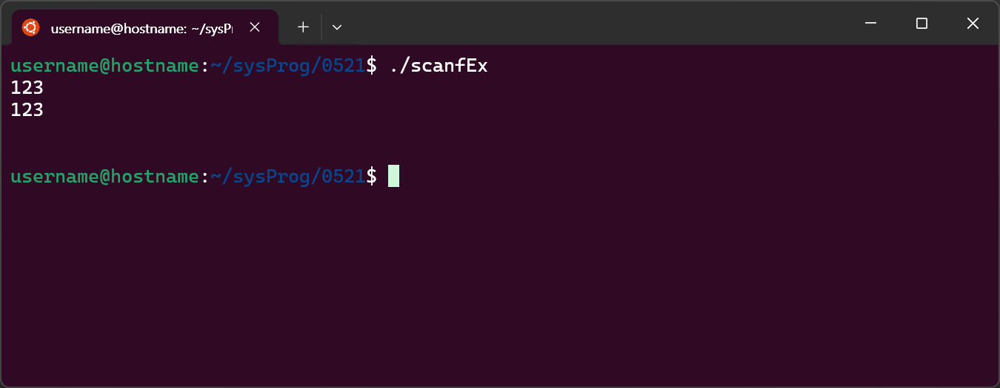
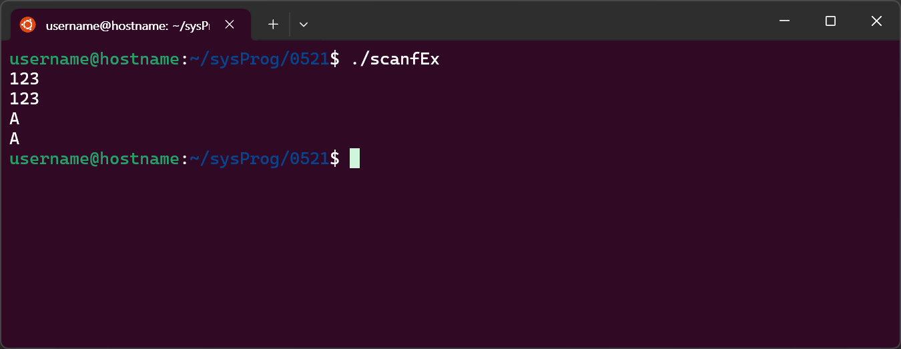
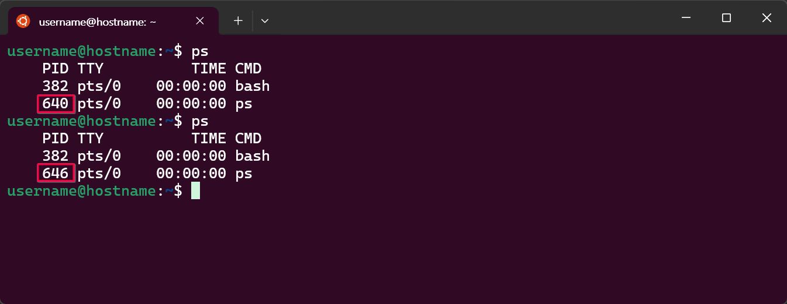
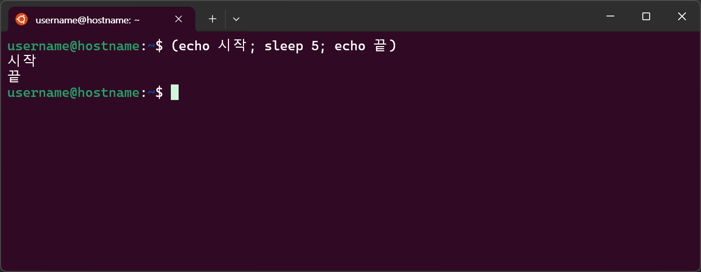
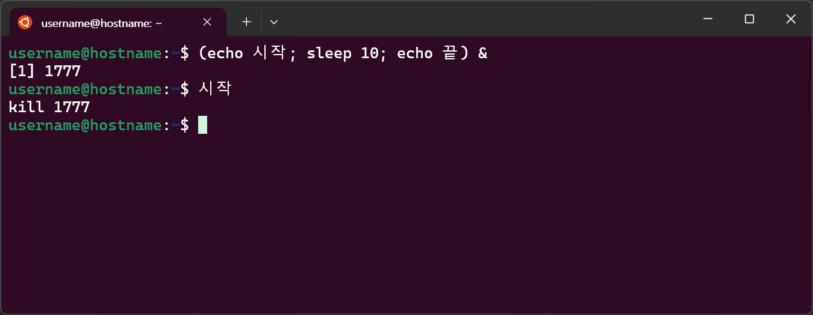
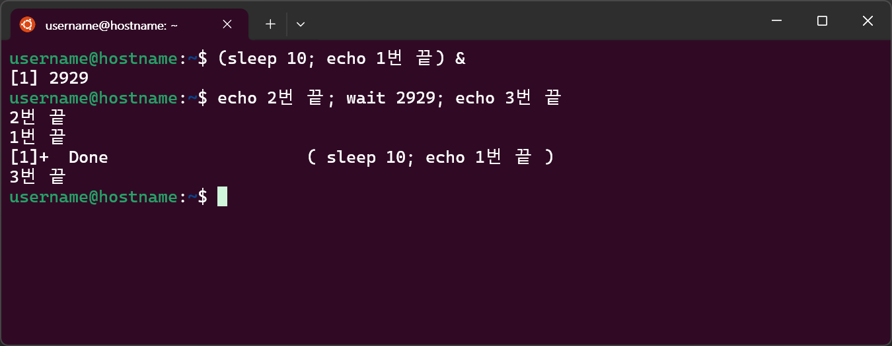
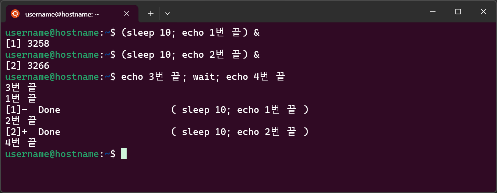
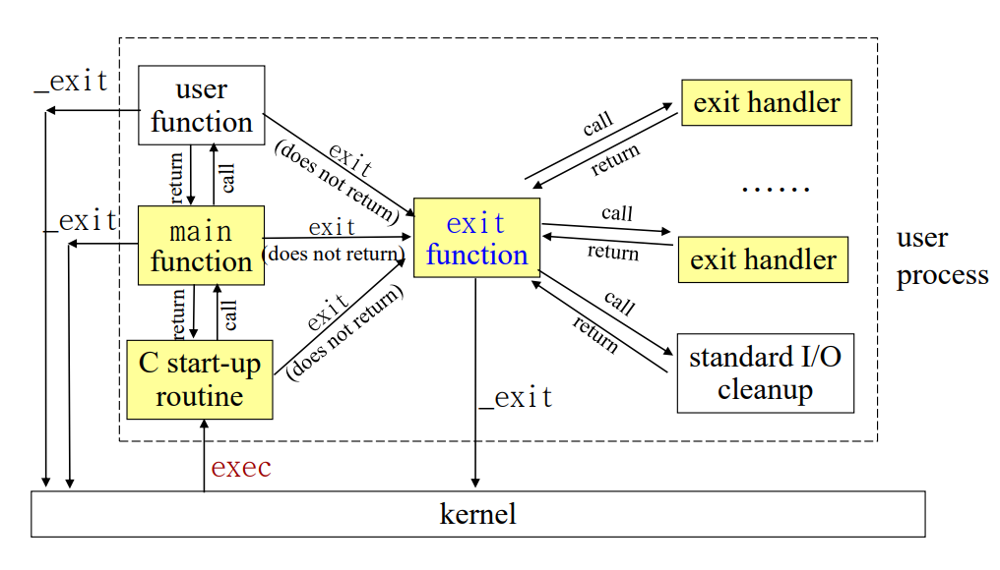

# File & record lock, C 표준 파일 입출력, Process
---
## ToC
- [파일과 레코드 잠금](#파일과-레코드-잠금)
    - [프로세스 간 데이터 교환](#프로세스-간-데이터-교환)
    - [lock(잠금)](#lock잠금)
    - [잠금 구현하기](#잠금-구현하기)
- [C 표준 파일 입출력](#c-표준-파일-입출력)
    - [파일](#파일)
    - [C언어의 파일 입출력 과정](#c언어의-파일-입출력-과정)
    - [실습 - `scanf()`의 문제점과 해결 방법](#참고-scanf의-문제점과-해결-방법)
    - [C 라이브러리 버퍼](#c-라이브러리-버퍼)
- [Process](#process)
    - [전면 처리와 후면 처리](#전면-처리와-후면-처리)
    - [프로세스](#프로세스process)
    - [C 프로그램의 시작 및 종료](#c-프로그램의-시작-및-종료)

---
# 파일과 레코드 잠금

## 프로세스 간 데이터 교환
### 방법
- 한 프로세스가 파일에 쓴 내용을 다른 프로세스가 읽음
### 문제점 (문제가 생기는 경우)
- 한 프로세스가 파일의 내용을 수정하는 동안, 다른 프로세스가 그 파일을 읽는 경우
- 두 프로세스가 동시에 하나의 파일에 접근해 데이터를 쓰는 경우
### 해결 방법
- lock(잠금)을 사용

---
## lock(잠금)
- 한 프로세스가 읽거나 수정할 때 다른 프로세스의 접근을 제한함
- 잠금된 영역에 대해 한 번에 하나의 프로세스만 접근 허용
### 잠금의 종류
- #### 읽기 잠금
	- 여러 프로세스가 공유 가능
- #### 쓰기 잠금
	- 공유할 수 없음
	- 한 프로세스만 접근 가능
### 권고 잠금과 강제 잠금
- #### 권고 잠금(advisory locking)
	- 잠금을 할 수 있지만 강제되지는 않음
	- 이미 잠금된 파일 영역에 대해서 잠금 규칙을 무시하고 읽기·쓰기 가능
	- 관련된 모든 프로세스들의 자발적인 잠금 규칙 준수
- #### 강제 잠금(mandatory locking)
	- 이미 잠금된 파일 영역에 대해 규칙 무시 불가
	- 커널이 잠금 규칙을 강제함 → 시스템 부하 증가
	- System V 계열에서 제공
	- Linux에서 파일 시스템 마운트 시 `-o mand` 옵션 사용해야 제공됨

---
## 잠금 구현하기
잠금 함수
### `fcntl()`(시스템 호출)
- 파일 및 레코드 잠금 구현
- 지정된 영역에 대한 잠금 검사, 설정, 해제
```c
#include <sys/types.h>
#include <unistd.h>
#include <fcntl.h>
int fcntl(int fd, int cmd, struct flock *lock);
```
- 반환값 → 성공: `0`, 실패: `-1`
- `fd`: 대상이 되는 파일 디스크립터
- `cmd`: 잠금 검사, 잠금 설정
	- `F_GETLK`: 잠금 검사
	- `F_SETLK`: 잠금 설정 / 해제
	- `F_SETLKW`: 잠금 설정(블로킹 버전) / 해제
- `flock` 구조체
	- 잠금 종류, 프로세스 ID, 잠금 위치 등
### `lockf()`(함수)
- 지정된 영역에 대한 잠금 검사, 설정, 해제
```c
#include <unistd.h>
int lockf(int fd, int cmd, off_t len);
```
- 반환값 → 성공: `0`, 실패: `-1`
- `fd`: 대상 파일 디스크립터
- `cmd`: 잠금 설정, 검사, 해제
	- `F_LOCK`: 지정된 영역에 대해 잠금 설정
		- 잠금이 되어있는 경우, 해제될 때까지 대기
	- `F_TLOCK`: 지정된 영역에 대해 잠금 설정
		- 잠금이 되어있는 경우, 즉시 오류(`-1`) 반환
	- `F_TEST`: 지정된 영역의 잠금여부 검사
		- 잠금 되어있지 않은 경우 → `0` 반환
		- 잠금 되어있는 경우 → `-1` 반환
	- `F_ULOCK`: 지정된 영역의 잠금 해제
- `len`: 잠금 영역
	- 현재 파일 위치부터 `len`길이 까지

---
# C 표준 파일 입출력
## 시스템 호출과 C 라이브러리 함수
- #### 시스템 호출(System Calls)
	- Unix 커널에 서비스 요청하는 호출
	- C 함수처럼 호출 가능
	- UNIX `man`의 Section **2**
- #### C 라이브러리 함수(Library Functions)
	- "시스템 호출을 포장해 놓은 함수"
		- "최적화 되어 있는 시스템 호출"
	- 내부에서 시스템 호출함

> 보통 C 라이브러리 함수를 사용하고,
> 필요시 시스템 호출을 직접 사용
> (시스템 부하를 줄이기 위함)

## 시스템 호출
- 커널에서 서비스 요청을 위한 프로그래밍 인터페이스
- 응용 프로그램은 시스템 호출을 통해 커널에 서비스를 요청함


---
## 파일
- 정보를 영속적으로 저장하기 위함
	- ↔ 변수에 저장된 정보는 실행이 끝나면 사라짐
### 유닉스 파일
- 모든 데이터를 연속된 바이트 형태로 저장함
### C언어의 파일 종류
- #### 텍스트 파일(text file)
	- 사람들이 읽을 수 있는 **문자들을 저장**하는 파일
	- 텍스트 파일에서 **한 줄의 끝을 나타내는 표현**은 C에서 내부 방식으로 변환됨
- #### 이진 파일(binary file)
	- 모든 데이터를 있는 그대로, **바이트의 연속**으로 저장하는 파일
	- 메모리에 저장된 변수 값의 형태 그대로 파일에 저장 가능

> [!note]
> ### 한 줄의 끝을 나타내는 표현 (↵)
> ASCII code 13(`\r`, Carriage Return), ASCII 10(`\n`, Line Feed)

---
## C언어의 파일 입출력 과정
- ① 파일 열기 - `fopen()`
- ② 파일 입출력 - 다양한 파일 입출력 함수 사용
- ③ 파일 닫기 - `fclose()`

### 파일 열기 - `fopen()`
- 파일 열기를 하면 해당 **파일의 구조체에 대한 포인터**가 리턴됨
	- 파일 포인터(`FILE *`)는 열린 파일을 나타냄(가리킴)
```c
FILE *fopen(const char *filename, const char *mode);
```
- `*filename`: 파일 명에 대한 포인터
- `*mode`: 파일을 여는 방식

> [!note]
> ### 파일 구조체(FILE Struct)
> - 하나의 스트림에 대한 정보를 포함하는구조체
> 	- 버퍼에 대한 포인터, 버퍼 크기, 등
> 	- 파일 디스크립터
> - 열린 파일의 현재 상태를 나타내는 필드 변수들
> 	- 파일 입출력에 사용되는 버퍼 관련 변수들

### 파일 입출력 함수

| 표준 입출력 함수   | 파일 입출력 함수           | 기능             |
| ----------- | ------------------- | -------------- |
| `getchar()` | `fgetc()`, `getc()` | 문자단위로 입력       |
| `putchar()` | `fputc()`, `putc()` | 문자단위로 출력       |
| `gets()`    | `fgets()`           | 문자열을 입력        |
| `puts()`    | `fputs()`           | 문자열을 출력        |
| `scanf()`   | `fscanf()`          | 자료형에 따라 자료를 입력 |
| `printf()`  | `fprintf()`         | 자료형에 따라 자료를 출력 |

> [!note] 
> ### getchar의 3가지 종류
> (문자를 입력 받는 함수)
> - `getch`: 입력된 문자를 에코(화면에 출력)하지 않고 반환
> 	- 비표준 함수
> - `getche`: 입력된 문자를 에코함
> 	- 비표준 함수
> - `getchar`: 표준 입력으로 문자를 읽고, 에코함
> 	- 표준 C 라이브러리 함수

> [!note] 
> ### 표준 입출력 함수
> - `#include <stdio.h>`
> - 파일 포인터(`FILE *`)를 인수로 전달해야 함
> 	- 열린 파일을 가리키는 FILE 구조체에 대한 포인터

### 파일 닫기
- 사용을 마친 파일을 닫기
```c
int fclose(FILE *fp);
```
- 반환값 → 닫기 성공: `0`, 오류: `EOF`(`-1`)
- `fp`: `fopen()`함수에서 받았던 포인터
- 사용 예) `fclose(fp);`

## 참고) `scanf()`의 문제점과 해결 방법
### 설계 의도
- ① 숫자를 입력 후 엔터를 누름 → 입력한 숫자를 출력 후, 문자를 입력 받음
- ② 문자를 입력 후 엔터를 누름 → 입력한 문자를 출력 후, 프로그램을 종료함
### 문제 상황
- 숫자를 입력 후 엔터를 누르면, 입력한 숫자를 출력 후, 프로그램이 종료됨


### 원인
- `scanf()`함수는 버퍼에 담겨진 내용을 가져와 사용함
- 입력 버퍼 공간에 개행 문자(`\n`)도 함께 담겨지게됨
### 해결 방법  1
- `fflush()`를 이용하기
	- 버퍼 값 초기화
- 비표준 방식
### 해결 방법 2
- `getchar()`를 사용하기
- 입력과 동시에 저장된 개행 문자를 사용
```c
// 예시
scanf("%d", &numinput);
printf("%d\n", numinput);
getchar(); // 개행문자 사용
scanf("%c" ,&charinput);
printf("%c", charinput);
```
### 해결 방법 3
- `scanf()`의 `%c`앞에 공백(` `)을 추가하기
- 입력 스트림에서 공백(스페이스, 탭, 줄바꿈)을 건너뛰고, 다음 유효한 문자를 읽음
https://github.com/seoftbh/24-1_SysProg/blob/76e84fc74b2958409a3831e26ff6ac392c03dcc2/week12/0521/scanfEx.c#L1-L12



---
## C 라이브러리 버퍼
### 사용 목적
- 디스크 I/O 수행의 최소화
- 최적의 크기 단위로 I/O 수행
- 시스템 성능 향상
### 버퍼 방식
- #### 완전 버퍼 방식 (fully buffered)
	- 버퍼가 가득 찬 경우 실제 I/O를 수행함
	- ex) 디스크 파일 입출력
- #### 줄 버퍼 방식 (line buffered)
	- 줄 바꿈 문자(newline)에서 실제 I/O 수행
	- ex) 터미널 입출력 (stdin, stdout)
- #### 버퍼 미사용 방식 (unbuffered)
	- 버퍼를 사용하지 않음
	- ex) 표준 에러 (stderr)

> [!note] 
> ### 버퍼(buffer)
> 입출력 향상을 위한 임시 메모리 공간

> [!note] 
> ### 표준 I/O 스트림
> - 프로그램이 시작되면 자동으로 open되는 스트림(stream)
> - `stdin`, `stdout`, `stderr`
> - `FILE*`
> - `#include <stdio.h>`
> 
> ### 표준 입출력 포인터
> - `stdin`
> 	- 표준 입력에 대한 FILE 포인터
> 	- fd `1`
> 	- 가리키는 장치: **키보드**
> - `stdout`
> 	- 표준 출력에 대한 FILE 포인터
> 	- fd `2`
> 	- 가리키는 장치: **모니터**
> - `stderr`
> 	- 표준 오류에 대한 FILE 포인터
> 	- fd `3`
> 	- 가리키는 장치: **키보드**

---
# Process
## 전면 처리와 후면 처리
### 전면 처리
- 입력한 명령어가 전면에서 실행됨
- 명령어 실행이 끝날 때까지 셸이 기다려 줌
	- 끝날 때까지 다른 명령 실행 불가
```bash
(sleep 10; echo done)
```
### 후면 처리
- 명령어들을 후면에서 처리함
	- 백그라운드에서 실행
- 전면에서는 다른 작업을 할 수 있음
	- 동시에 여러 작업 수행 가능
- 명령어 뒤에 `&`기호를 붙임
```bash
(sleep 10; echo done)&
```

---
## 프로세스(process)
- 실행 중인 프로그램
- 프로세스마다 유일한 번호인 **PID**를 부여 받음
	- `ps` 명령어로 확인 가능

### `ps` - 프로세스 상태 출력
- 현재 존재하는 프로세스들의 실행 상태를 요약해서 출력


### `sleep`
- 지정된 시간만큼 실행을 중지시킴
- `sleep 초단위시간`
```bash
(echo 시작; sleep 5; echo 끝)
```


### `kill`
- 현재 실행중인 프로세스를 강제로 종료
- `kill [-시그널] 프로세스번호`
```bash
(echo 시작; sleep 10; echo 끝) &
kill 프로세스의번호(PID)
```


### `wait`
- 해당 프로세스 번호를 갖는, 자식 프로세스가 종료될 때까지 기다림
- 프로세스 번호를 지정하지 않으면, 모든 자식 프로세스를 기다림

#### 예제 1)
```bash
(sleep 10; echo 1번 끝) &
echo 2번 끝; wait 앞_명령어의_PID; echo 3번 끝
```


#### 예제 2)
```bash
(sleep 10; echo 1번 끝) &
(sleep 10; echo 2번 끝) &
echo 3번 끝; wait; echo 4번 끝
```


### `exit`
- 셸을 종료 후, 종료코드(exit code)를 부모 프로세스에 전달함
- `exit [ 종료코드 ]`

---
## C 프로그램의 시작 및 종료


### 프로그램 실행 시작
- #### exec 시스템 호출
	- C시작 루틴에게 명령줄 인수와 환경 변수를 전달함함
	- 프로그램을 실행시킴
- #### C 시작 루틴(C start-up routine)
	- main 함수를 호출함
		- 명령줄 인수, 환경 변수를 전달함
	- 실행이 끝나면 반환값을 받아 exit 함
- #### `main()` 함수 호출
### 프로그램 종료
- #### `exit()`
	- 뒷정리를 한 후 프로세스를 정상적으로 종료시킴
		- 모든 열려진 스트림을 닫음(fclose)
		- 출력 버퍼의 내용을 디스크에 기록함(fflush)
		- 종료 코드(exit code)를 부모 프로세스에게 전달
	- exit handler 들을 등록된 역순으로 호출함
- #### `_exit()`
	- 뒷정리를 하지 않고 프로세스를 즉시 종료시킴
- #### exit 처리기(exit handler) 등록
	- 프로세스당 32개까지 등록
	- `exit()`에 의한 프로세스 종료 과정에서 자동으로 수행됨

---
