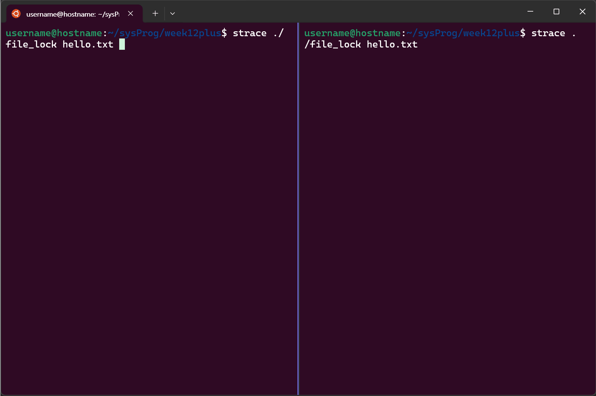
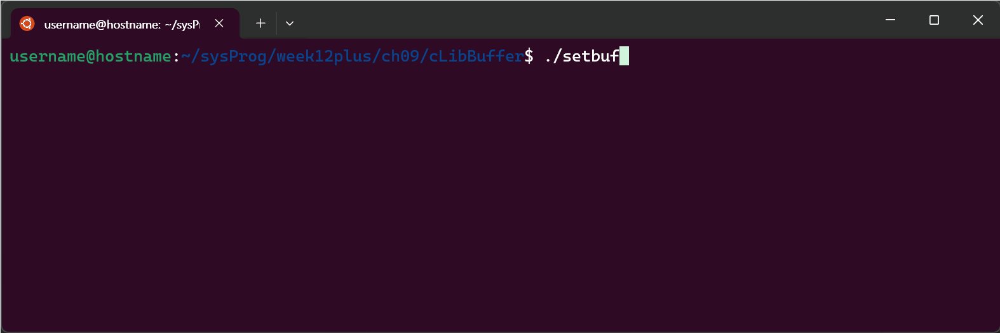

# File & record lock


## `rdlock.c` - 잠금을 이용한 학생DB 조회
### 잠금 함수 `fcntl()` 이용
- 해당 레코드를 읽기 전, 해당 레코드 영역에 읽기 잠금(`F_RDLCK`) 후 읽음
### 소스 코드
https://github.com/seoftbh/24-1_SysProg/blob/e439481f7006c707574d4176ca6a4a0dfaf13f8a/week12plus/ch08/studentDB/rdlock.c#L1-L46

## `wrlock.c` - 잠금을 이용한 학생DB 수정
### 잠금 함수 `fcntl()` 이용
- 해당 레코드를 읽기 전, 해당 레코드 영역에 쓰기 잠금(`F_WRLCK`) 후 수정함
### 소스 코드
https://github.com/seoftbh/24-1_SysProg/blob/e439481f7006c707574d4176ca6a4a0dfaf13f8a/week12plus/ch08/studentDB/wrlock.c#L1-L50

---
## 파일 쓰기 잠금 예제
파일 잠금을 통해 한 프로세스(왼쪽)가 사용하고 있을 때 다른 프로세스(오른쪽)가 접근하지 못하도록 함


https://github.com/seoftbh/24-1_SysProg/blob/e439481f7006c707574d4176ca6a4a0dfaf13f8a/week12plus/ch08/filelockEx/file_lock.c#L1-L28

---
---
# C 표준 파일 입출력
## 문자 단위 입출력
- 파일에 문자 단위 입출력
- `fgetc()`
	- `int fgetc(FILE *fp)`
	- fp가 지정한 파일에서 한 문자 읽어서 리턴
- `fputc()`
	- `int fputc(int c, FILE *fp)`
	- 파일에 한 문자씩 출력

### 텍스트 파일 내용을 표준 출력에 프린트하기
https://github.com/seoftbh/24-1_SysProg/blob/e439481f7006c707574d4176ca6a4a0dfaf13f8a/week12plus/ch09/charIO/filePrint.c#L1-L19

### 파일 복사
https://github.com/seoftbh/24-1_SysProg/blob/e439481f7006c707574d4176ca6a4a0dfaf13f8a/week12plus/ch09/charIO/fileCopy.c#L1-L24


---
## 줄 단위 입출력
- 텍스트 파일에서 한 줄씩 읽거나 쓰기
- `fgets()`
	- `char* fgets(char *s, int n FILE *fp)`
	- 파일로부터 한 줄을 읽어서 문자열 포인터`s`에 저장 후 `s`를 리턴
- `fputs()`
	- `int fputs(const char *s, FILE *fp)`
	- 문자열 `s`를 파일 포인터 `fp`가 가리키는 파일에 출력

### 텍스트 파일에 줄 번호를 붙여 출력하기
https://github.com/seoftbh/24-1_SysProg/blob/e439481f7006c707574d4176ca6a4a0dfaf13f8a/week12plus/ch09/lineIO/lineNum.c#L1-L25


---
## 포맷 입출력
- `fprintf()`
	- `int fprintf(FILE *fp, const char *format, ...)`
	- 파일에 데이터 출력하기
- `fscanf()`
	- `int fscanf(FILE *fp, const char *format, ...)`
	- 파일로부터 데이터 읽기
### 학생 정보를 읽어 텍스트에 저장하기
https://github.com/seoftbh/24-1_SysProg/blob/e439481f7006c707574d4176ca6a4a0dfaf13f8a/week12plus/ch09/formatIO/studentWrite.c#L1-L19

### 텍스트 파일에서 학생 정보를 읽어 출력하기
https://github.com/seoftbh/24-1_SysProg/blob/e439481f7006c707574d4176ca6a4a0dfaf13f8a/week12plus/ch09/formatIO/studentRead.c#L1-L19


---
## 블록 단위 입출력
- 한 번에 일정한 크기의 데이터를 파일에 읽거나 쓰기
- `fread()`
	- `int fread(void *bif, int size, int n, FILE *fp)`
	- 파일 포인터`fp`가 가리키는 파일에서 `size`크기의 블록을 `n`개 읽고, 버퍼 포인터 `buf`가 가리키는 곳에 저장
- `fwrite()`
	- `int fwrite(const void *buf, int size, int n, FILE *fp)`
	- 버퍼`buf`에 저장되어 있는 `size` 크기의 블록을 `fp`가 지정한 파일에 `n`개 기록

### 구조체를 이용해 학생 정보를 파일에 저장하기
`stcreate1.c`, `student.h`
https://github.com/seoftbh/24-1_SysProg/blob/e439481f7006c707574d4176ca6a4a0dfaf13f8a/week12plus/ch09/blockIO/stcreate1.c#L1-L19
https://github.com/seoftbh/24-1_SysProg/blob/e439481f7006c707574d4176ca6a4a0dfaf13f8a/week12plus/ch09/blockIO/student.h#L1-L8

### 파일에 저장된 모든 학생 정보 읽어서 출력하기
`stprint.c`
https://github.com/seoftbh/24-1_SysProg/blob/e439481f7006c707574d4176ca6a4a0dfaf13f8a/week12plus/ch09/blockIO/stprint.c#L1-L27


---
## 파일 내 위치
- `fseek()`
	- `fseek(FILE *fp, long offset, int mode)`
	- 파일 포인터(`fp`)가 가리키고 있는 파일에서, 파일 위치를 모드(`mode`)기준으로 오프셋(`offset`)만큼 옮김

### 구조체를 이용한 학생 정보 저장, 조회하기
레코드 단위로 이동
`stcreate2.c`, `stquery.c`
https://github.com/seoftbh/24-1_SysProg/blob/e439481f7006c707574d4176ca6a4a0dfaf13f8a/week12plus/ch09/filePosition/stcreate2.c#L1-L22
https://github.com/seoftbh/24-1_SysProg/blob/e439481f7006c707574d4176ca6a4a0dfaf13f8a/week12plus/ch09/filePosition/stquery.c#L5-L39

### 저장된 학생 정보 수정하기
레코드 수정
`stupdate.c`
https://github.com/seoftbh/24-1_SysProg/blob/e439481f7006c707574d4176ca6a4a0dfaf13f8a/week12plus/ch09/filePosition/stupdate.c#L1-L40


---
# C 라이브러리 버퍼
### C 라이브러리 버퍼 방식
- 완전 버퍼 방식 → 디스크 파일 입출력
- 줄 버퍼 방식 → 터미널 입출력(stdin, stdout)
- 버퍼 미사용 방식 → 표준 에러(stderr)

`buffer.c`

https://github.com/seoftbh/24-1_SysProg/blob/e439481f7006c707574d4176ca6a4a0dfaf13f8a/week12plus/ch09/cLibBuffer/buffer.c#L1-L41

> [!tip]
> #### `_IO_UNBUFFERED` 및 `_IO_LINE_BUF` 오류
> ```c
> #ifdef __GLIBC__  
> #define _IO_UNBUFFERED 0x0002  
> #define _IO_LINE_BUF 0x0200  
> #endif
> ```
> 출처:  [우분투 에러 질문입니다. | KLDP](https://kldp.org/node/165354)


### 버퍼 관리 방법 변경
- `setbuf()`
	- `void setbuf(FILE *fp, char *buf)`
	- 버퍼 사용 여부를 정함
	- `buf`가 `NULL`인 경우 → 버퍼 미사용 방식
	- `buf`가 `BUFSIZ`크기의 공간을 가리키는 경우 → 완전 / 줄 버퍼 방식


- `setvbuf()`
	- `int setvbuf(FILE *fp, char *buf, int mode, size_t size)`
	- 버퍼 사용 방법 변경
	- mode
		- `_IOFBF`: 완전 버퍼 방식
		- `_IOLBF`: 줄 버퍼 방식
		- `_IONBF`: 버퍼 미사용 방식


https://github.com/seoftbh/24-1_SysProg/blob/e439481f7006c707574d4176ca6a4a0dfaf13f8a/week12plus/ch09/cLibBuffer/setbuf.c#L1-L19
https://github.com/seoftbh/24-1_SysProg/blob/e439481f7006c707574d4176ca6a4a0dfaf13f8a/week12plus/ch09/cLibBuffer/setvbuf.c#L1-L16

---
# Process
## 프로그램 실행 시작
### 명령줄 인수 출력
`args.c`
- `int main(int argc, char *argv[])`
	- `argc`: 명령줄 인수의 개수
	- `argv[]`: 명령줄 인수 리스트를 나타내는 포인터 배열


https://github.com/seoftbh/24-1_SysProg/blob/e439481f7006c707574d4176ca6a4a0dfaf13f8a/week12plus/ch10/args.c#L1-L10

## 환경 변수
### 모든 환경 변수 출력

https://github.com/seoftbh/24-1_SysProg/blob/e439481f7006c707574d4176ca6a4a0dfaf13f8a/week12plus/ch10/environ.c#L1-L11

### 환경 변수 개별 출력
- `getenv()`를 이용하면 환경 변수를 하나씩 접근 가능


https://github.com/seoftbh/24-1_SysProg/blob/e439481f7006c707574d4176ca6a4a0dfaf13f8a/week12plus/ch10/printenv.c#L1-L14

## 프로그램 종료
### exit 처리기 예제
- `atexit()`
	- `void atexit(void (*func)(void))`
	- exit 처리기 등록(프로세스당 32개까지)
	- `func`: exit 처리기; 함수 포인터(이름)
	- `exit()`는 exit handler들을 등록된 역순으로 호출함


https://github.com/seoftbh/24-1_SysProg/blob/e439481f7006c707574d4176ca6a4a0dfaf13f8a/week12plus/ch10/exitHandlerEx.c#L1-L20

