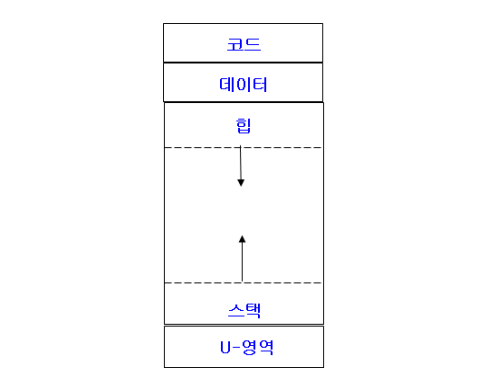
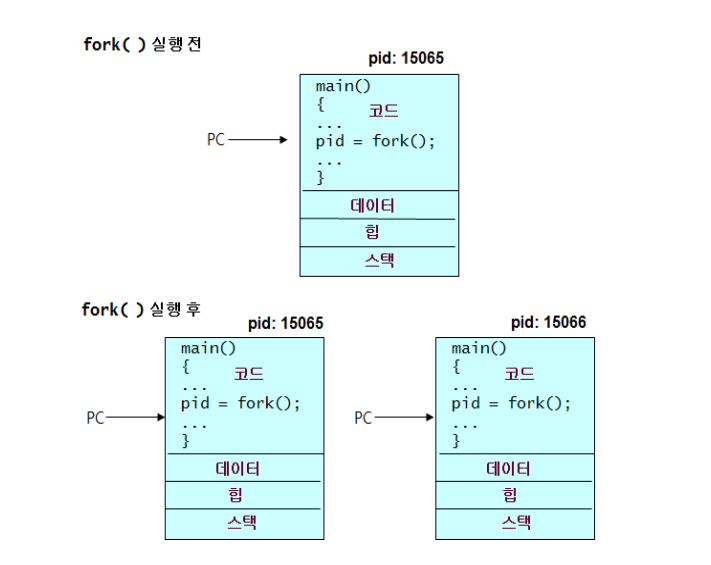
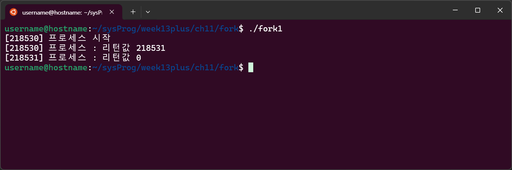
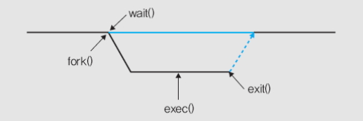
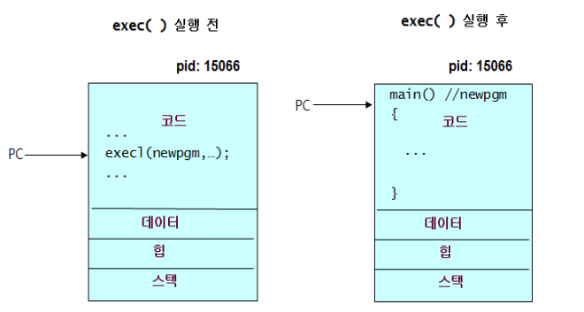

# 프로세스, 프로세스 제어

---
## ToC
- [프로세스](#프로세스)
    - [프로세스 ID](#프로세스-id)
    - [프로세스의 사용자 ID](#프로세스의-사용자-id)
    - [set-user-id 권한을 가진 실행 파일](#set-user-id-권한을-가진-실행-파일)
    - [프로세스의 구조](#프로세스의-구조)
- [프로세스 제어](#프로세스-제어)
    - [프로세스 생성](#프로세스-생성-fork)
    - [실습 - `fork1.c`](#실습---fork1c)
	- [부모 프로세스와 자식 프로세스 구분](#부모-프로세스와-자식-프로세스-구분)
	- [프로세스 기다리기 `wait()`](#프로세스-기다리기-wait)
	- [`fork()` 후 파일 공유](#fork-후-파일-공유)
	- [프로그램 실행 `exec()`](#프로그램-실행-exec)
	- [`system()` 함수](#system--함수)

---
# 프로세스
- 프로세스가 가지는 ID의 종류
	- **PID**: 프로세스 고유 ID
	- 실제 사용자 ID
	- 유효 사용자 ID
	- 실제 그룹 ID
	- 유효 그룹 ID

## 프로세스 ID
- #### 프로세스 ID
	- `int getpid()`
	- 프로세스를 구별하는 번호인 **프로세스 ID**가 프로세스마다 부여됨
- #### 부포 프로세스 ID
	- `int getppid()`
	- ==각 프로세스는 자신을 생성해준 **부모 프로세스**가 존재함==

## 프로세스의 사용자 ID
- 프로세스는 프로세스 ID외 프로세스의 **사용자 ID**와 **그룹 ID**를 가짐
	- 해당 프로세스를 실행시킨 사용자의 ID와 사용자 그룹 ID
	- 프로세스가 수행할 수 있는 연산을 결정하는데 사용됨

### 프로세스의 사용자 ID
- #### 실제 사용자 ID(real user ID)
	- 해당 프로세스를 실행한 원래 사용자의 사용자 ID
- #### 유효 사용자 ID(effective user ID)
	- 새로운 파일 생성 또는 파일에 대한 접근 권한 검사 시 사용됨
	- 틀별한 실행파일을 실행할 때를 제외하면 대부분의 경우 유효 사용자 ID와 실제 사용자 ID가 동일함

### 사용자/그룹 ID 반환

```c
#include <sys/types.h>
#include <unistd.h>
uid_t getuid();		// 프로세스의 실제 사용자 ID 반환
uid_t geteuid();	// 프로세스의 유효 사용자 ID 반환
uid_t getgid();		// 프로세스의 실제 그룹 ID 반환
uid_t getegid();	// 프로세스의 유효 그룹 ID 반환
```

### 사용자/그룹 ID 변경
```c
#include <sys/types.h>
#include <unistd.h>
int setuid(uid_t uid);		// 프로세스의 실제 사용자 ID를 uid로 변경
int seteuid(uid_t uid);		// 프로세스의 유효 사용자 ID를 uid로 변경
int setgid(gid_t gid);		// 프로세스의 실제 그룹 ID를 gid로 변경
int setegid(gid_t gid);		// 프로세스의 유효 그룹 ID를 gid로 변경
```

---
## `set-user-id` 권한을 가진 실행 파일
- 틀별한 실행권한
- set-user-id(set user ID upon execution)로 설정된 파일
	- 실행 시 프로세스의 유효 사용자 ID가 소유자로 바뀌게됨
		- 실행되는 동안 파일의 소유자 권한을 갖게 됨
- 실행권한은 심볼릭 모드에 `s`로 표시됨
```bash
# 예
$ ls –asl /bin/su /usr/bin/passwd
32 -rwsr-xr-x. 1 root root 32396 2011-05-31 01:50 /bin/su
28 -rwsr-xr-x. 1 root root 27000 2010-08-22 12:00 /usr/bin/passwd
```
### 예) `passwd` 명령어
- `/usr/bin/passwd` 파일은 `set-user-id` 실행권힌이 설정된 실행파일
	- 소유자는 root
- 일반 사용자가 실행 시 프로세스의 유효 사용자 ID는 root가됨
- `/etc/passwd`처럼 root만 수저할 수 있는 파일의 접근 및 수정 가능

### set-uid 실행권한 설정
```bash
# 예
chmod 4755 file1
```

### set-gid 비트 설정
```bash
# 예) 강제 잠금 설정
chmod 2755 file1
```

---
## 프로세스의 구조
### 프로세스
- ==프로세스는 실행 중인 프로그램==
	- 프로그램자체가 프로세스는 아님
- 프로그램을 실행하기 위해서는 프로그램의 코드, 데이터, 스택, 힙, U-영역 등이 필요
- 프로세스 이미지(구조)는 메모리 내의 프로세스 레이아웃

### 프로세스 구조
(프로세스 이미지의 구조)


- #### 텍스트(text, 코드)
	- 프로세스가 실행하는 실행 코드를 저장하는 영역
- #### 데이터(data)
	- 전역 변수(global variable) 및 정적 변수(static variable)를 위한 메모리 영역
- #### 힙(heap)
	- 동적 메모리 할당을 위한 영역
	- cf) C언어의 `malloc()`함수 호출 시 이 영역에서 동적으로 메모리를 할당해 줌
- #### 스택(stack area)
	- 함수 호출을 구현하기 위한 실행시간 스택(runtime stack)을 위한 영역
	- 활성 레코드(activation record)가 저장됨
- #### U-영역(uesr-area)
	- 프로세스의 정보를 저장하는 영역
		- 열린 파일 디스크립터(fd), 현재 작업 디렉터리 등

---
---
# 프로세스 제어
## 프로세스 생성 `fork()`
- `fork()` (시스템 콜)
	- 부모 프로세스를 똑같이 복제해 새로운 자식 프로세스를 생성함
		- 새로운 자식 생성
		- 자식 프로세스에 **`0`** 리턴
		- 부모 프로세스에 **자식 프로세스 ID** 리턴
	- "자기복제"
	- 
```c
#include <sys/types.h>
#include <unistd.h>
pid_t fork(void);
```

### `fork()`의 특징
- 한 번 호출 시 두 번 리턴됨
	- 자식 프로세스에게 **`0`** 리턴
	- 부모 프로세스에게 **자식 프로세스 ID** 리턴
- 부모 프로세스와 자식 프로세스는 각각 병행적으로 계속해서 실행됨


## 실습 - `fork1.c`

1. 프로세스가 실행되며 운영체제가 PID를 부여함(`218530`)
2. `fork()`함수가 실행되며 자식 프로세스가 생성됨(PID:`218531`)
3. 부모 프로세스는 자식 프로세스의 ID(`218531`)를 리턴함
4. 자식 프로세스는 `0`을 리턴함

https://github.com/seoftbh/24-1_SysProg/blob/35c54b2d7b488bb516290f725e06a692c82cc67f/week13/0528/fork1.c#L1-L10

## 부모 프로세스와 자식 프로세스 구분
- `fork()` 호출 후의 리턴 값을 이용해 구분함
	- 자식 프로세스 → `0`리턴
	- 부모 프로세스 → 자식 프로세스 ID
- 리턴값으로 구분 후 서로 다른 동작 실행 가능

```c
pid = fork();
if (pid == 0)
{
    자식 프로세스의 실행 코드
}
else
{
    부모 프로세스의 실행 코드
}
```

---
## 프로세스 기다리기 `wait()`
- 자식 프로세스 중 하나가 끝날 때까지 기다림
	- 실행이 끝난 자식 프로세스의 종료 코드가 `status`에 저장되고, 자식 프로셋의 번호를 리턴함


```c
#include <sys/types.h>
#include <sys/wait.h>
pid_t wait(int *status);
pid_t waitpid(pid_t pid, int *statloc, int options);
```

## `fork()` 후, 파일 공유
- 자식 프로세스는 부모 프로세스의 fd 테이블을 복사함
	- 동일한 파일 디스크립트(fd)를 공유함
	- 동일한 파일 오프셋을 공유함
	- 출력이 서로 섞이게 됨
- 자식 프로세스에게 상속되지 않는 성질
	- `fork()`의 반환값
	- 프로세스 ID
	- 파일 잠금
	- 설정된 알람, 시그널

---
## 프로그램 실행 `exec()`
- `exec()` (시스템 콜)
	- **프로세스 내 프로그램을 새 프로그램으로 대체**
- 주로 `fork()` 후에 `exec()`를 사용함
	- 새로 실행할 프로그램에 대한 정보를 arguments로 전달함
	- `fork()` 후 자식 프로세스는 부모 프로세스와 동일한 코드를 실행함
	- 자식 프로세스에게 새 프로그램을 실행시키려는 경우 `exec()`를 사용

### `exec()` 호출
- #### 프로세스가 `exec()`호출 시
	- → 해당 프로세스 내 프로그램이 완전히 새로운 프로그램으로 대체됨
		- "자기대치"
		- 새 프로그램의 `main()`부터 실행됨
	- 호출한 프로세스의 코드, 데이터, 힙, 스택 등 → path가 나타내는 새로운 프로그램으로 대치 → 새 프로그램 실행
- #### 반환값
	- 성공 시 → 리턴값 없음
	- 실패 시 → `-1` 리턴
- #### 호출 성공 시
	- 자식 프로세스는 새로운 프로그램을 실행함
	- 부모 프로세스는 다음 코드를 실행함
```c
#include <unistd.h>
int execl(char* path, char* arg0, char* arg1, ..., char* argn, NULL)
int execv(char* path, char* argv[])
int execlp(char* file, char* arg0, char* arg1, ..., char* argn, NULL)
iint execvp(char* file, char* argv[])
```



---
## `system()`  함수
- `system()`함수로 셸(shell) 명령을 실행할 수 있음
- 자식 프로세스를 생성 후, `/bin/sh`가 지정된 명령을 실행시키게 함
	- `/bin/sh -c cmdstring`을 호출해 `cmdstring`에 지정된 명령어를 실행 함
- #### 반환값
	- 해당 명령어의 종료 코드
	- `-1` 과 `errno` → `fork()` 또는 `waitpid()` 실패
		- `errno`는 오류 발생시 그 원인을 나타내는 코드가 저장되는 전역 변수
	- `127` → `exec()` 실패
```c
#include <stdlib.h>
int system(const char *cmdstring);
```

### `system()`함수 구현
- `fork()`, `exec()`, `waitpid()` 시스템 콜 이용


