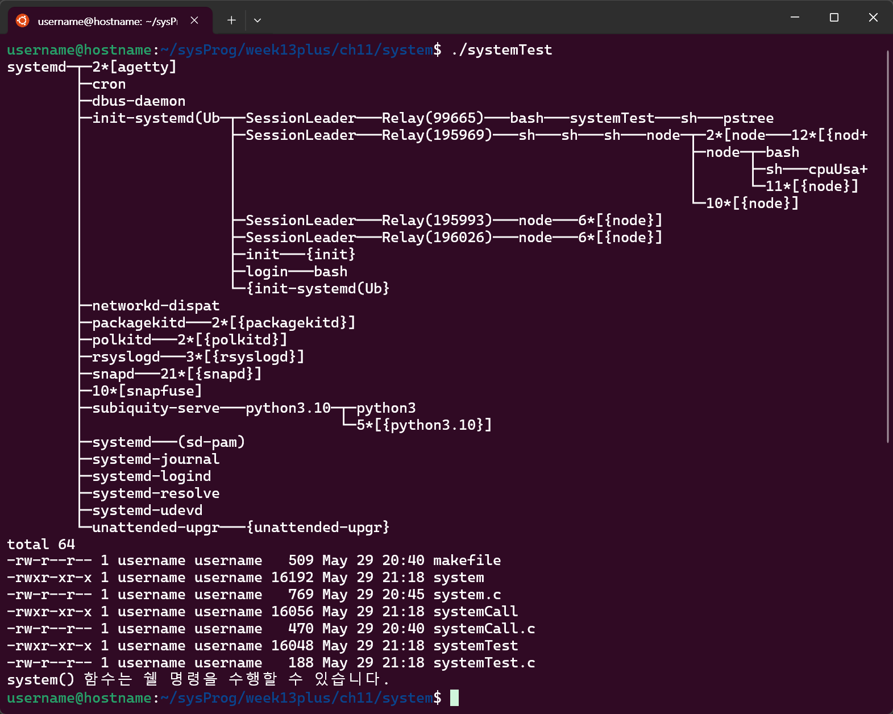

# 프로세스
### `pid.c` - 프로세스 번호 출력
- `int getpid()`
	- 프로세스의 ID 리턴
	- 프로세스를 구별하는 번호
- `int getppid()`
	- 부모 프로세스의 ID 리턴
	- 자신을 생성해준 부모 프로세스의 번호

https://github.com/seoftbh/24-1_SysProg/blob/710a9a69933734a9f9b0a0e978be79e3707b2eeb/week13plus/ch10/pid.c#L1-L8

### `uid.c` - 프로세스의 사용자 ID 출력
- 프로세스의 실제/유효 사용자 ID 반환
	- `uid_t getuid()`: 프로세스의 실제 사용자 ID
	- `uid_tgeteuid()`: 프로세스의 유효 사용자 ID
- 프로세스의 실제/유효 그룹 ID 반환
	- `uid_t getgid()`: 프로세스의 실제 그룹 ID
	- `uid_t getegid()`: 프로세스의 유효 그룹 ID

https://github.com/seoftbh/24-1_SysProg/blob/710a9a69933734a9f9b0a0e978be79e3707b2eeb/week13plus/ch10/uid.c#L1-L12

### 실행 결과

---
---
# 프로세스 제어

## 프로세스 생성
- `pid_t fork(void)`
	- 새로운 자식 프로세스를 생성함
	- 자식 프로세스에는 `0`을 리턴함
	- 부모 프로세스에는 '자식 프로세스 ID'를 리턴함
### 자식 프로세스 생성
`fork1.c`

https://github.com/seoftbh/24-1_SysProg/blob/710a9a69933734a9f9b0a0e978be79e3707b2eeb/week13plus/ch11/fork/fork1.c#L1-L10

### 부모 프로세스가 자식 프로세스 생성 후 서로 다른 메시지 출력
`fork2.c`

https://github.com/seoftbh/24-1_SysProg/blob/710a9a69933734a9f9b0a0e978be79e3707b2eeb/week13plus/ch11/fork/fork2.c#L1-L16

### 부모 프로세스가 두 개의 자식 프로세스 생성
`fork3.c`

https://github.com/seoftbh/24-1_SysProg/blob/710a9a69933734a9f9b0a0e978be79e3707b2eeb/week13plus/ch11/fork/fork3.c#L1-L20

## 프로세스 기다리기

### 부모 프로세스가 자식 프로세스 생성 후 끝나기를 기다림
1. 부모 프로세스가 시작됨(PID:`219128`)
2. `fork()`호출로 자식 프로세스가 생성됨(PID:`219129`)
4. 부모 프로세스가 `wait()`함수를 호출해 자식 프로세스가 종료될 때까지 기다림
3. 자식 프로세스가 종료 코드 1로 종료됨
5. 자식 프로세스가 종료되면, 부모 프로세스가 자식 프로세스의 PID와 종료 코드를 출력함

`forkWait.c`

https://github.com/seoftbh/24-1_SysProg/blob/710a9a69933734a9f9b0a0e978be79e3707b2eeb/week13plus/ch11/wait/forkWait.c#L1-L20

### 2개의 자식 프로세스 기다리기
1. 부모 프로세스가 시작됨(PID:`223542`)
2. `fork()`호출로 첫 번째 자식 프로세스가 생성됨(PID:`223543`), 1초 후 종료 코드 1로 종료됨
3. 부모 프로세스가 `fork()`호출로 두 번째 자식 프로세스를 생성함(PID:`223544`), 2초 후 종료 코드 2로 종료됨
4. 부모 프로세스가 `waitpid()`함수를 호출해 첫 번째 프로세스의 종료를 기다림
5. 첫 번째 자식 프로세스가 종료되면, 부모 프로세스가 PID와 종료 코드를 출력함

`waitPid.c`

https://github.com/seoftbh/24-1_SysProg/blob/710a9a69933734a9f9b0a0e978be79e3707b2eeb/week13plus/ch11/wait/waitPid.c#L1-L30

## 프로그램 실행

### 자식 프로세스를 생성해 echo 명령어 실행
`exec1.c`

https://github.com/seoftbh/24-1_SysProg/blob/710a9a69933734a9f9b0a0e978be79e3707b2eeb/week13plus/ch11/exec/exec1.c#L1-L15

### 각각의 명령어를 실행하는 3개의 자식 프로세스 생성
`exec2.c`

https://github.com/seoftbh/24-1_SysProg/blob/710a9a69933734a9f9b0a0e978be79e3707b2eeb/week13plus/ch11/exec/exec2.c#L1-L27

### 명령줄 인수로 받은 명령 실행시키기
`exec3.c`

https://github.com/seoftbh/24-1_SysProg/blob/710a9a69933734a9f9b0a0e978be79e3707b2eeb/week13plus/ch11/exec/exec3.c#L1-L22

---
## `system()` 함수

### `system()`함수 실행
- `system()`함수로 셸 명령어를 실행할 수 있음
`systemTest.c`

https://github.com/seoftbh/24-1_SysProg/blob/710a9a69933734a9f9b0a0e978be79e3707b2eeb/week13plus/ch11/system/systemTest.c#L1-L9

### `system()`함수 구현
- 시스템 호출을 이용
	- `fork()`, `exec()`, `waitpid()`
- 반환값
	- 명령어의 종료 코드
	- `-1`과 `errno`: `fork()` 혹은 `waitpid()` 실패
		- `errno`는 오류 발생시 그 원인을 나타내는 코드가 저장되는 전역 변수
	- `127`: `exec()` 실패

`systemCall.c`, `system.c`

https://github.com/seoftbh/24-1_SysProg/blob/710a9a69933734a9f9b0a0e978be79e3707b2eeb/week13plus/ch11/system/system.c#L1-L30
https://github.com/seoftbh/24-1_SysProg/blob/710a9a69933734a9f9b0a0e978be79e3707b2eeb/week13plus/ch11/system/systemCall.c#L1-L15
